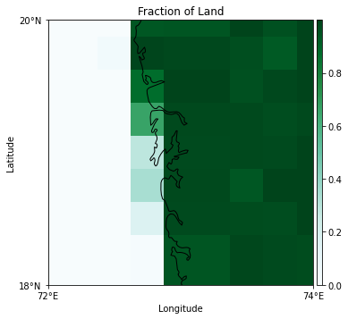
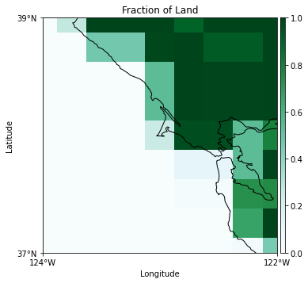
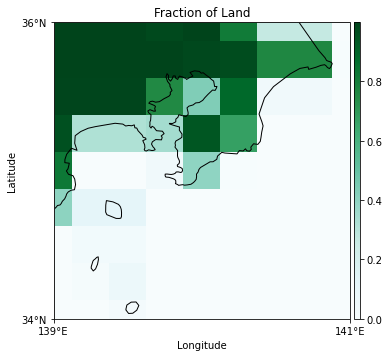
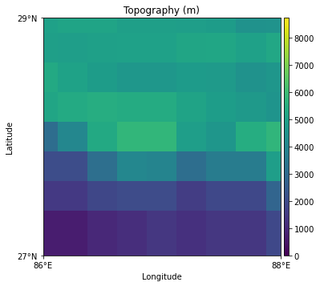
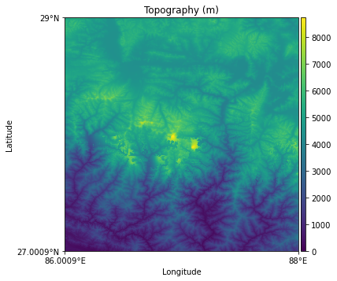

# Analysis-Ready, Cloud Optimized ERA5

Recipes for reproducing Analysis-Ready & Cloud Optimized (ARCO) ERA5 datasets.

[Introduction](#introduction) • [Overview](#overview) • [Get Started with Colab Notebooks](#get-started-with-colab-notebooks) • [Analysis Ready Data](#analysis-ready-data)
• [Raw Cloud Optimized Data](#raw-cloud-optimized-data) • [Project roadmap](#project-roadmap) • [How to reproduce](#how-to-reproduce)
• [FAQs](#faqs) • [How to cite this work](#how-to-cite-this-work) • [License](#license)

## Introduction

Our goal is to make a global history of the climate highly accessible in the cloud. To that end, we present a curated
copy of the ERA5 corpus in [Google Cloud Public Datasets](https://cloud.google.com/storage/docs/public-datasets/era5).

<details>
<summary>What is ERA5?</summary>

ERA5 is the fifth generation of [ECMWF's](https://www.ecmwf.int/) Atmospheric Reanalysis. It spans atmospheric, land,
and ocean variables. ERA5 is an hourly dataset with global coverage at 30km resolution (~0.28° x 0.28°), ranging from
1979 to the present. The total ERA5 dataset is about 5 petabytes in size.

Check out [ECMWF's documentation on ERA5](https://www.ecmwf.int/en/forecasts/datasets/reanalysis-datasets/era5) for
more.

</details>

<details>
<summary>What is a reanalysis?</summary>

A reanalysis is the "most complete picture currently possible of past weather and climate." Reanalyses are created from
assimilation of a wide range of data sources via numerical weather prediction (NWP) models.

Read [ECMWF's introduction to reanalysis](https://www.ecmwf.int/en/about/media-centre/focus/2020/fact-sheet-reanalysis)
for more.

</details>

So far, we have ingested meteorologically valuable variables for the land and atmosphere. From this, we have produced a
cloud-optimized version of ERA5, in which we have converted [grib data](https://en.wikipedia.org/wiki/GRIB)
to [Zarr](https://zarr.readthedocs.io/) with no other modifications. In addition, we have created "analysis-ready"
versions on regular lat-lon grids, oriented towards common research & ML workflows.

This two-pronged approach for the data serves different user needs. Some researchers need full control over the
interpolation of data for their analysis. Most will want a batteries-included dataset, where standard pre-processing and
chunk optimization is already applied. In general, we ensure that every step in this pipeline is open and reproducible,
to provide transparency in the provenance of all data.

## Overview

| Location       | Type            | Description                                                                   |
|----------------|-----------------|-------------------------------------------------------------------------------|
| `$BUCKET/ar/`  | Analysis Ready  | An ML-ready, unified (surface & atmospheric) version of the data in Zarr.     |
| `$BUCKET/co/`  | Cloud Optimized | A port of gaussian-gridded ERA5 data to Zarr.                                 |
| `$BUCKET/raw/` | Raw Data        | All raw grib & NetCDF data.                                                   |  

 - The `gcp-public-data-arco-era5` bucket is stored in the `us-central1` (Iowa)
   Google Cloud region.
 - The stable version of ERA5 is updated on a **monthly cadence** (on roughly the 9th of each month) with a 3 month delay. The preliminary version of ERA5, known as ERA5T is available with approximately 1 week delay (where 5-6 days delay are due to processing at ECWMF).

## Get Started with Colab Notebooks

Explore the ERA5 dataset interactively with these notebooks:

| Notebook | Description | Open in Colab |
|----------|-------------|---------------|
| [Surface Reanalysis Walkthrough](https://github.com/google-research/arco-era5/blob/main/docs/0-Surface-Reanalysis-Walkthrough.ipynb) | Learn how to work with surface-level ERA5 data | [](https://colab.research.google.com/github/google-research/arco-era5/blob/main/docs/0-Surface-Reanalysis-Walkthrough.ipynb) |
| [Model Levels Walkthrough](https://github.com/google-research/arco-era5/blob/main/docs/1-Model-Levels-Walkthrough.ipynb) | Explore atmospheric model levels data | [](https://colab.research.google.com/github/google-research/arco-era5/blob/main/docs/1-Model-Levels-Walkthrough.ipynb) | 
 - The most recent data available can be found by examining the metadata associated with each Zarr store. The metadata encompasses three essential attributes: `valid_time_start`, `valid_time_stop` (for ERA5), and `last_updated`. For ERA5T, use `valid_time_stop_era5t` instead. These attributes specify the start date, stop date, and most recent time of update for the dataset's data, respectively. Please note that both start and end times are inclusive, and all times are given in UTC.

## Analysis Ready Data

These datasets have been regridded to a uniform 0.25° equiangular horizontal resolution to facilitate downstream analyses, e.g., with [WeatherBench2](https://github.com/google-research/weatherbench2).

### 0.25° Pressure and Surface Level Data

This dataset contains most pressure-level fields and all surface-level field regridded to a uniform 0.25° resolution.
It is a superset of the data used to train [GraphCast](https://github.com/google-deepmind/graphcast) and
[NeuralGCM](https://github.com/google-research/neuralgcm).

```python
import xarray

ds = xarray.open_zarr(
    'gs://gcp-public-data-arco-era5/ar/full_37-1h-0p25deg-chunk-1.zarr-v3',
    chunks=None,
    storage_options=dict(token='anon'),
)
ar_full_37_1h = ds.sel(time=slice(ds.attrs['valid_time_start'], ds.attrs['valid_time_stop']))
```

* _Times_: `00/to/23`
* _Levels_: `1/2/3/5/7/10/20/30/50/70/100/125/150/175/200/225/250/300/350/400/450/500/550/600/650/700/750/775/800/825/850/875/900/925/950/975/1000`
* _Grid_: equiangular lat-lon
* _Size_: 2.05 PB
* _Chunking_: `{'time': 1, 'latitude': 721, 'longitude': 1440, 'level': 37}`
* _Chunk size (per variable)_: 154 MB


<details>
<summary>Data summary table</summary>

|name                                                           |short name    |units                |docs                                             |config                                            |
|---------------------------------------------------------------|--------------|---------------------|-------------------------------------------------|--------------------------------------------------|
|100m_u_component_of_wind                                       |100u          |m s**-1              |https://codes.ecmwf.int/grib/param-db/228246     |[era5_sl_hourly.cfg](raw/daily/era5_sl_hourly.cfg)|
|100m_v_component_of_wind                                       |100v          |m s**-1              |https://codes.ecmwf.int/grib/param-db/228247     |[era5_sl_hourly.cfg](raw/daily/era5_sl_hourly.cfg)|
|10m_u_component_of_neutral_wind                                |u10n          |m s**-1              |https://codes.ecmwf.int/grib/param-db/228131     |[era5_sl_hourly.cfg](raw/daily/era5_sl_hourly.cfg)|
|10m_u_component_of_wind                                        |10u           |m s**-1              |https://codes.ecmwf.int/grib/param-db/165        |[era5_sl_hourly.cfg](raw/daily/era5_sl_hourly.cfg)|
|10m_v_component_of_neutral_wind                                |v10n          |m s**-1              |https://codes.ecmwf.int/grib/param-db/228132     |[era5_sl_hourly.cfg](raw/daily/era5_sl_hourly.cfg)|
|10m_v_component_of_wind                                        |10v           |m s**-1              |https://codes.ecmwf.int/grib/param-db/166        |[era5_sl_hourly.cfg](raw/daily/era5_sl_hourly.cfg)|
|10m_wind_gust_since_previous_post_processing                   |10fg          |m s**-1              |https://codes.ecmwf.int/grib/param-db/49         |[era5_sl_hourly.cfg](raw/daily/era5_sl_hourly.cfg)|
|2m_dewpoint_temperature                                        |2d            |K                    |https://codes.ecmwf.int/grib/param-db/168        |[era5_sl_hourly.cfg](raw/daily/era5_sl_hourly.cfg)|
|2m_temperature                                                 |2t            |K                    |https://codes.ecmwf.int/grib/param-db/167        |[era5_sl_hourly.cfg](raw/daily/era5_sl_hourly.cfg)|
|air_density_over_the_oceans                                    |rhoao         |kg m**-3             |https://codes.ecmwf.int/grib/param-db/140209     |[era5_sl_hourly.cfg](raw/daily/era5_sl_hourly.cfg)|
|angle_of_sub_gridscale_orography                               |anor          |radians              |https://codes.ecmwf.int/grib/param-db/162        |[era5_sl_hourly.cfg](raw/daily/era5_sl_hourly.cfg)|
|anisotropy_of_sub_gridscale_orography                          |isor          |~                    |https://codes.ecmwf.int/grib/param-db/161        |[era5_sl_hourly.cfg](raw/daily/era5_sl_hourly.cfg)|
|benjamin_feir_index                                            |bfi           |dimensionless        |https://codes.ecmwf.int/grib/param-db/140253     |[era5_sl_hourly.cfg](raw/daily/era5_sl_hourly.cfg)|
|boundary_layer_dissipation                                     |bld           |J m**-2              |https://codes.ecmwf.int/grib/param-db/145        |[era5_sl_hourly.cfg](raw/daily/era5_sl_hourly.cfg)|
|boundary_layer_height                                          |blh           |m                    |https://codes.ecmwf.int/grib/param-db/159        |[era5_sl_hourly.cfg](raw/daily/era5_sl_hourly.cfg)|
|charnock                                                       |chnk          |~                    |https://codes.ecmwf.int/grib/param-db/148        |[era5_sl_hourly.cfg](raw/daily/era5_sl_hourly.cfg)|
|clear_sky_direct_solar_radiation_at_surface                    |cdir          |J m**-2              |https://codes.ecmwf.int/grib/param-db/228022     |[era5_sl_hourly.cfg](raw/daily/era5_sl_hourly.cfg)|
|cloud_base_height                                              |cbh           |m                    |https://codes.ecmwf.int/grib/param-db/228023     |[era5_sl_hourly.cfg](raw/daily/era5_sl_hourly.cfg)|
|coefficient_of_drag_with_waves                                 |cdww          |dimensionless        |https://codes.ecmwf.int/grib/param-db/140233     |[era5_sl_hourly.cfg](raw/daily/era5_sl_hourly.cfg)|
|convective_available_potential_energy                          |cape          |J kg**-1             |https://codes.ecmwf.int/grib/param-db/59         |[era5_sl_hourly.cfg](raw/daily/era5_sl_hourly.cfg)|
|convective_inhibition                                          |cin           |J kg**-1             |https://codes.ecmwf.int/grib/param-db/228001     |[era5_sl_hourly.cfg](raw/daily/era5_sl_hourly.cfg)|
|convective_precipitation                                       |cp            |m                    |https://codes.ecmwf.int/grib/param-db/228143     |[era5_sl_hourly.cfg](raw/daily/era5_sl_hourly.cfg)|
|convective_rain_rate                                           |crr           |kg m**-2 s**-1       |https://codes.ecmwf.int/grib/param-db/228218     |[era5_sl_hourly.cfg](raw/daily/era5_sl_hourly.cfg)|
|convective_snowfall                                            |csf           |m of water equivalent|https://codes.ecmwf.int/grib/param-db/239        |[era5_sl_hourly.cfg](raw/daily/era5_sl_hourly.cfg)|
|convective_snowfall_rate_water_equivalent                      |csfr          |kg m**-2 s**-1       |https://codes.ecmwf.int/grib/param-db/228220     |[era5_sl_hourly.cfg](raw/daily/era5_sl_hourly.cfg)|
|downward_uv_radiation_at_the_surface                           |uvb           |J m**-2              |https://codes.ecmwf.int/grib/param-db/57         |[era5_sl_hourly.cfg](raw/daily/era5_sl_hourly.cfg)|
|duct_base_height                                               |dctb          |m                    |https://codes.ecmwf.int/grib/param-db/228017     |[era5_sl_hourly.cfg](raw/daily/era5_sl_hourly.cfg)|
|eastward_gravity_wave_surface_stress                           |lgws          |N m**-2 s            |https://codes.ecmwf.int/grib/param-db/195        |[era5_sl_hourly.cfg](raw/daily/era5_sl_hourly.cfg)|
|eastward_turbulent_surface_stress                              |ewss          |N m**-2 s            |https://codes.ecmwf.int/grib/param-db/180        |[era5_sl_hourly.cfg](raw/daily/era5_sl_hourly.cfg)|
|evaporation                                                    |e             |m of water equivalent|https://codes.ecmwf.int/grib/param-db/182        |[era5_sl_hourly.cfg](raw/daily/era5_sl_hourly.cfg)|
|forecast_albedo                                                |fal           |(0 - 1)              |https://codes.ecmwf.int/grib/param-db/243        |[era5_sl_hourly.cfg](raw/daily/era5_sl_hourly.cfg)|
|forecast_logarithm_of_surface_roughness_for_heat               |flsr          |~                    |https://codes.ecmwf.int/grib/param-db/245        |[era5_sl_hourly.cfg](raw/daily/era5_sl_hourly.cfg)|
|forecast_surface_roughness                                     |fsr           |m                    |https://codes.ecmwf.int/grib/param-db/244        |[era5_sl_hourly.cfg](raw/daily/era5_sl_hourly.cfg)|
|fraction_of_cloud_cover                                        |cc            |(0 - 1)              |https://codes.ecmwf.int/grib/param-db/248        |[era5_pl_hourly.cfg](raw/daily/era5_pl_hourly.cfg)|
|free_convective_velocity_over_the_oceans                       |wstar         |m s**-1              |https://codes.ecmwf.int/grib/param-db/140208     |[era5_sl_hourly.cfg](raw/daily/era5_sl_hourly.cfg)|
|friction_velocity                                              |zust          |m s**-1              |https://codes.ecmwf.int/grib/param-db/228003     |[era5_sl_hourly.cfg](raw/daily/era5_sl_hourly.cfg)|
|geopotential_at_surface                                        |z             |m2 s-2               |https://codes.ecmwf.int/grib/param-db/129        |[era5_sl_hourly.cfg](raw/daily/era5_sl_hourly.cfg)|
|gravity_wave_dissipation                                       |gwd           |J m**-2              |https://codes.ecmwf.int/grib/param-db/197        |[era5_sl_hourly.cfg](raw/daily/era5_sl_hourly.cfg)|
|high_cloud_cover                                               |hcc           |(0 - 1)              |https://codes.ecmwf.int/grib/param-db/3075       |[era5_sl_hourly.cfg](raw/daily/era5_sl_hourly.cfg)|
|high_vegetation_cover                                          |cvh           |(0 - 1)              |https://codes.ecmwf.int/grib/param-db/28         |[era5_sl_hourly.cfg](raw/daily/era5_sl_hourly.cfg)|
|ice_temperature_layer_1                                        |istl1         |K                    |https://codes.ecmwf.int/grib/param-db/35         |[era5_sl_hourly.cfg](raw/daily/era5_sl_hourly.cfg)|
|ice_temperature_layer_2                                        |istl2         |K                    |https://codes.ecmwf.int/grib/param-db/36         |[era5_sl_hourly.cfg](raw/daily/era5_sl_hourly.cfg)|
|ice_temperature_layer_3                                        |istl3         |K                    |https://codes.ecmwf.int/grib/param-db/37         |[era5_sl_hourly.cfg](raw/daily/era5_sl_hourly.cfg)|
|ice_temperature_layer_4                                        |istl4         |K                    |https://codes.ecmwf.int/grib/param-db/38         |[era5_sl_hourly.cfg](raw/daily/era5_sl_hourly.cfg)|
|instantaneous_10m_wind_gust                                    |i10fg         |m s**-1              |https://codes.ecmwf.int/grib/param-db/228029     |[era5_sl_hourly.cfg](raw/daily/era5_sl_hourly.cfg)|
|instantaneous_eastward_turbulent_surface_stress                |iews          |N m**-2              |https://codes.ecmwf.int/grib/param-db/229        |[era5_sl_hourly.cfg](raw/daily/era5_sl_hourly.cfg)|
|instantaneous_large_scale_surface_precipitation_fraction       |ilspf         |(0 - 1)              |https://codes.ecmwf.int/grib/param-db/228217     |[era5_sl_hourly.cfg](raw/daily/era5_sl_hourly.cfg)|
|instantaneous_moisture_flux                                    |ie            |kg m**-2 s**-1       |https://codes.ecmwf.int/grib/param-db/232        |[era5_sl_hourly.cfg](raw/daily/era5_sl_hourly.cfg)|
|instantaneous_northward_turbulent_surface_stress               |inss          |N m**-2              |https://codes.ecmwf.int/grib/param-db/230        |[era5_sl_hourly.cfg](raw/daily/era5_sl_hourly.cfg)|
|instantaneous_surface_sensible_heat_flux                       |ishf          |W m**-2              |https://codes.ecmwf.int/grib/param-db/231        |[era5_sl_hourly.cfg](raw/daily/era5_sl_hourly.cfg)|
|k_index                                                        |kx            |K                    |https://codes.ecmwf.int/grib/param-db/260121     |[era5_sl_hourly.cfg](raw/daily/era5_sl_hourly.cfg)|
|lake_bottom_temperature                                        |lblt          |K                    |https://codes.ecmwf.int/grib/param-db/228010     |[era5_sl_hourly.cfg](raw/daily/era5_sl_hourly.cfg)|
|lake_cover                                                     |cl            |(0 - 1)              |https://codes.ecmwf.int/grib/param-db/26         |[era5_sl_hourly.cfg](raw/daily/era5_sl_hourly.cfg)|
|lake_depth                                                     |dl            |m                    |https://codes.ecmwf.int/grib/param-db/228007     |[era5_sl_hourly.cfg](raw/daily/era5_sl_hourly.cfg)|
|lake_ice_depth                                                 |licd          |m                    |https://codes.ecmwf.int/grib/param-db/228014     |[era5_sl_hourly.cfg](raw/daily/era5_sl_hourly.cfg)|
|lake_ice_temperature                                           |lict          |K                    |https://codes.ecmwf.int/grib/param-db/228013     |[era5_sl_hourly.cfg](raw/daily/era5_sl_hourly.cfg)|
|lake_mix_layer_depth                                           |lmld          |m                    |https://codes.ecmwf.int/grib/param-db/228009     |[era5_sl_hourly.cfg](raw/daily/era5_sl_hourly.cfg)|
|lake_mix_layer_temperature                                     |lmlt          |K                    |https://codes.ecmwf.int/grib/param-db/228008     |[era5_sl_hourly.cfg](raw/daily/era5_sl_hourly.cfg)|
|lake_shape_factor                                              |lshf          |dimensionless        |https://codes.ecmwf.int/grib/param-db/228012     |[era5_sl_hourly.cfg](raw/daily/era5_sl_hourly.cfg)|
|lake_total_layer_temperature                                   |ltlt          |K                    |https://codes.ecmwf.int/grib/param-db/228011     |[era5_sl_hourly.cfg](raw/daily/era5_sl_hourly.cfg)|
|land_sea_mask                                                  |lsm           |(0 - 1)              |https://codes.ecmwf.int/grib/param-db/172        |[era5_sl_hourly.cfg](raw/daily/era5_sl_hourly.cfg)|
|large_scale_precipitation                                      |lsp           |m                    |https://codes.ecmwf.int/grib/param-db/3062       |[era5_sl_hourly.cfg](raw/daily/era5_sl_hourly.cfg)|
|large_scale_precipitation_fraction                             |lspf          |s                    |https://codes.ecmwf.int/grib/param-db/50         |[era5_sl_hourly.cfg](raw/daily/era5_sl_hourly.cfg)|
|large_scale_rain_rate                                          |lsrr          |kg m**-2 s**-1       |https://codes.ecmwf.int/grib/param-db/228219     |[era5_sl_hourly.cfg](raw/daily/era5_sl_hourly.cfg)|
|large_scale_snowfall                                           |lsf           |m of water equivalent|https://codes.ecmwf.int/grib/param-db/240        |[era5_sl_hourly.cfg](raw/daily/era5_sl_hourly.cfg)|
|large_scale_snowfall_rate_water_equivalent                     |lssfr         |kg m**-2 s**-1       |https://codes.ecmwf.int/grib/param-db/228221     |[era5_sl_hourly.cfg](raw/daily/era5_sl_hourly.cfg)|
|leaf_area_index_high_vegetation                                |lai_hv        |m2 m-2               |https://codes.ecmwf.int/grib/param-db/67         |[era5_sl_hourly.cfg](raw/daily/era5_sl_hourly.cfg)|
|leaf_area_index_low_vegetation                                 |lai_lv        |m2 m-2               |https://codes.ecmwf.int/grib/param-db/66         |[era5_sl_hourly.cfg](raw/daily/era5_sl_hourly.cfg)|
|low_cloud_cover                                                |lcc           |(0 - 1)              |https://codes.ecmwf.int/grib/param-db/3073       |[era5_sl_hourly.cfg](raw/daily/era5_sl_hourly.cfg)|
|low_vegetation_cover                                           |cvl           |(0 - 1)              |https://codes.ecmwf.int/grib/param-db/27         |[era5_sl_hourly.cfg](raw/daily/era5_sl_hourly.cfg)|
|maximum_2m_temperature_since_previous_post_processing          |mx2t          |K                    |https://codes.ecmwf.int/grib/param-db/201        |[era5_sl_hourly.cfg](raw/daily/era5_sl_hourly.cfg)|
|maximum_individual_wave_height                                 |hmax          |m                    |https://codes.ecmwf.int/grib/param-db/140218     |[era5_sl_hourly.cfg](raw/daily/era5_sl_hourly.cfg)|
|maximum_total_precipitation_rate_since_previous_post_processing|mxtpr         |kg m**-2 s**-1       |https://codes.ecmwf.int/grib/param-db/228226     |[era5_sl_hourly.cfg](raw/daily/era5_sl_hourly.cfg)|
|mean_boundary_layer_dissipation                                |avg_ibld      |W m**-2              |https://codes.ecmwf.int/grib/param-db/235032     |[era5_sl_hourly.cfg](raw/daily/era5_sl_hourly.cfg)|
|mean_convective_precipitation_rate                             |avg_cpr       |kg m**-2 s**-1       |https://codes.ecmwf.int/grib/param-db/235030     |[era5_sl_hourly.cfg](raw/daily/era5_sl_hourly.cfg)|
|mean_convective_snowfall_rate                                  |avg_csfr      |kg m**-2 s**-1       |https://codes.ecmwf.int/grib/param-db/235056     |[era5_sl_hourly.cfg](raw/daily/era5_sl_hourly.cfg)|
|mean_direction_of_total_swell                                  |mdts          |degrees              |https://codes.ecmwf.int/grib/param-db/140238     |[era5_sl_hourly.cfg](raw/daily/era5_sl_hourly.cfg)|
|mean_direction_of_wind_waves                                   |mdww          |degrees              |https://codes.ecmwf.int/grib/param-db/500072     |[era5_sl_hourly.cfg](raw/daily/era5_sl_hourly.cfg)|
|mean_eastward_gravity_wave_surface_stress                      |avg_iegwss    |N m**-2              |https://codes.ecmwf.int/grib/param-db/235045     |[era5_sl_hourly.cfg](raw/daily/era5_sl_hourly.cfg)|
|mean_eastward_turbulent_surface_stress                         |avg_iews      |N m**-2              |https://codes.ecmwf.int/grib/param-db/235041     |[era5_sl_hourly.cfg](raw/daily/era5_sl_hourly.cfg)|
|mean_evaporation_rate                                          |erate         |m*s**-1              |https://codes.ecmwf.int/grib/param-db/172182     |[era5_sl_hourly.cfg](raw/daily/era5_sl_hourly.cfg)|
|mean_gravity_wave_dissipation                                  |avg_igwd      |W m**-2              |https://codes.ecmwf.int/grib/param-db/235047     |[era5_sl_hourly.cfg](raw/daily/era5_sl_hourly.cfg)|
|mean_large_scale_precipitation_fraction                        |avg_ilspf     |Proportion           |https://codes.ecmwf.int/grib/param-db/235026     |[era5_sl_hourly.cfg](raw/daily/era5_sl_hourly.cfg)|
|mean_large_scale_precipitation_rate                            |avg_lsprate   |kg m**-2 s**-1       |https://codes.ecmwf.int/grib/param-db/235029     |[era5_sl_hourly.cfg](raw/daily/era5_sl_hourly.cfg)|
|mean_large_scale_snowfall_rate                                 |avg_lssfr     |kg m**-2 s**-1       |https://codes.ecmwf.int/grib/param-db/235057     |[era5_sl_hourly.cfg](raw/daily/era5_sl_hourly.cfg)|
|mean_northward_gravity_wave_surface_stress                     |avg_ingwss    |N m**-2              |https://codes.ecmwf.int/grib/param-db/235046     |[era5_sl_hourly.cfg](raw/daily/era5_sl_hourly.cfg)|
|mean_northward_turbulent_surface_stress                        |avg_inss      |N m**-2              |https://codes.ecmwf.int/grib/param-db/235042     |[era5_sl_hourly.cfg](raw/daily/era5_sl_hourly.cfg)|
|mean_period_of_total_swell                                     |mpts          |s                    |https://codes.ecmwf.int/grib/param-db/140239     |[era5_sl_hourly.cfg](raw/daily/era5_sl_hourly.cfg)|
|mean_period_of_wind_waves                                      |mpww          |s                    |https://codes.ecmwf.int/grib/param-db/500074     |[era5_sl_hourly.cfg](raw/daily/era5_sl_hourly.cfg)|
|mean_potential_evaporation_rate                                |avg_pevr      |kg m**-2 s**-1       |https://codes.ecmwf.int/grib/param-db/235070     |[era5_sl_hourly.cfg](raw/daily/era5_sl_hourly.cfg)|
|mean_runoff_rate                                               |avg_rorwe     |kg m**-2 s**-1       |https://codes.ecmwf.int/grib/param-db/235048     |[era5_sl_hourly.cfg](raw/daily/era5_sl_hourly.cfg)|
|mean_sea_level_pressure                                        |msl           |Pa                   |https://codes.ecmwf.int/grib/param-db/151        |[era5_sl_hourly.cfg](raw/daily/era5_sl_hourly.cfg)|
|mean_snow_evaporation_rate                                     |avg_esrwe     |kg m**-2 s**-1       |https://codes.ecmwf.int/grib/param-db/235023     |[era5_sl_hourly.cfg](raw/daily/era5_sl_hourly.cfg)|
|mean_snowfall_rate                                             |avg_tsrwe     |kg m**-2 s**-1       |https://codes.ecmwf.int/grib/param-db/235031     |[era5_sl_hourly.cfg](raw/daily/era5_sl_hourly.cfg)|
|mean_snowmelt_rate                                             |avg_smr       |kg m**-2 s**-1       |https://codes.ecmwf.int/grib/param-db/235024     |[era5_sl_hourly.cfg](raw/daily/era5_sl_hourly.cfg)|
|mean_square_slope_of_waves                                     |msqs          |dimensionless        |https://codes.ecmwf.int/grib/param-db/140244     |[era5_sl_hourly.cfg](raw/daily/era5_sl_hourly.cfg)|
|mean_sub_surface_runoff_rate                                   |avg_ssurfror  |kg m**-2 s**-1       |https://codes.ecmwf.int/grib/param-db/235021     |[era5_sl_hourly.cfg](raw/daily/era5_sl_hourly.cfg)|
|mean_surface_direct_short_wave_radiation_flux                  |avg_sdirswrf  |W m**-2              |https://codes.ecmwf.int/grib/param-db/235058     |[era5_sl_hourly.cfg](raw/daily/era5_sl_hourly.cfg)|
|mean_surface_direct_short_wave_radiation_flux_clear_sky        |avg_sdirswrfcs|W m**-2              |https://codes.ecmwf.int/grib/param-db/235059     |[era5_sl_hourly.cfg](raw/daily/era5_sl_hourly.cfg)|
|mean_surface_downward_long_wave_radiation_flux                 |avg_sdlwrf    |W m**-2              |https://codes.ecmwf.int/grib/param-db/235036     |[era5_sl_hourly.cfg](raw/daily/era5_sl_hourly.cfg)|
|mean_surface_downward_long_wave_radiation_flux_clear_sky       |avg_sdlwrfcs  |W m**-2              |https://codes.ecmwf.int/grib/param-db/235069     |[era5_sl_hourly.cfg](raw/daily/era5_sl_hourly.cfg)|
|mean_surface_downward_short_wave_radiation_flux                |avg_sdswrf    |W m**-2              |https://codes.ecmwf.int/grib/param-db/235035     |[era5_sl_hourly.cfg](raw/daily/era5_sl_hourly.cfg)|
|mean_surface_downward_short_wave_radiation_flux_clear_sky      |avg_sdswrfcs  |W m**-2              |https://codes.ecmwf.int/grib/param-db/235068     |[era5_sl_hourly.cfg](raw/daily/era5_sl_hourly.cfg)|
|mean_surface_downward_uv_radiation_flux                        |avg_sduvrf    |W m**-2              |https://codes.ecmwf.int/grib/param-db/235027     |[era5_sl_hourly.cfg](raw/daily/era5_sl_hourly.cfg)|
|mean_surface_latent_heat_flux                                  |avg_slhtf     |W m**-2              |https://codes.ecmwf.int/grib/param-db/235034     |[era5_sl_hourly.cfg](raw/daily/era5_sl_hourly.cfg)|
|mean_surface_net_long_wave_radiation_flux                      |avg_snlwrf    |W m**-2              |https://codes.ecmwf.int/grib/param-db/235038     |[era5_sl_hourly.cfg](raw/daily/era5_sl_hourly.cfg)|
|mean_surface_net_long_wave_radiation_flux_clear_sky            |avg_snlwrfcs  |W m**-2              |https://codes.ecmwf.int/grib/param-db/235052     |[era5_sl_hourly.cfg](raw/daily/era5_sl_hourly.cfg)|
|mean_surface_net_short_wave_radiation_flux                     |avg_snswrf    |W m**-2              |https://codes.ecmwf.int/grib/param-db/235037     |[era5_sl_hourly.cfg](raw/daily/era5_sl_hourly.cfg)|
|mean_surface_net_short_wave_radiation_flux_clear_sky           |avg_snswrfcs  |W m**-2              |https://codes.ecmwf.int/grib/param-db/235051     |[era5_sl_hourly.cfg](raw/daily/era5_sl_hourly.cfg)|
|mean_surface_runoff_rate                                       |avg_surfror   |kg m**-2 s**-1       |https://codes.ecmwf.int/grib/param-db/235020     |[era5_sl_hourly.cfg](raw/daily/era5_sl_hourly.cfg)|
|mean_surface_sensible_heat_flux                                |avg_ishf      |W m**-2              |https://codes.ecmwf.int/grib/param-db/235033     |[era5_sl_hourly.cfg](raw/daily/era5_sl_hourly.cfg)|
|mean_top_downward_short_wave_radiation_flux                    |avg_tdswrf    |W m**-2              |https://codes.ecmwf.int/grib/param-db/235053     |[era5_sl_hourly.cfg](raw/daily/era5_sl_hourly.cfg)|
|mean_top_net_long_wave_radiation_flux                          |avg_tnlwrf    |W m**-2              |https://codes.ecmwf.int/grib/param-db/235040     |[era5_sl_hourly.cfg](raw/daily/era5_sl_hourly.cfg)|
|mean_top_net_long_wave_radiation_flux_clear_sky                |avg_tnlwrfcs  |W m**-2              |https://codes.ecmwf.int/grib/param-db/235050     |[era5_sl_hourly.cfg](raw/daily/era5_sl_hourly.cfg)|
|mean_top_net_short_wave_radiation_flux                         |avg_tnswrf    |W m**-2              |https://codes.ecmwf.int/grib/param-db/235039     |[era5_sl_hourly.cfg](raw/daily/era5_sl_hourly.cfg)|
|mean_top_net_short_wave_radiation_flux_clear_sky               |avg_tnswrfcs  |W m**-2              |https://codes.ecmwf.int/grib/param-db/235049     |[era5_sl_hourly.cfg](raw/daily/era5_sl_hourly.cfg)|
|mean_total_precipitation_rate                                  |avg_tprate    |kg m**-2 s**-1       |https://codes.ecmwf.int/grib/param-db/235055     |[era5_sl_hourly.cfg](raw/daily/era5_sl_hourly.cfg)|
|mean_vertical_gradient_of_refractivity_inside_trapping_layer   |dndza         |m**-1                |https://codes.ecmwf.int/grib/param-db/228016     |[era5_sl_hourly.cfg](raw/daily/era5_sl_hourly.cfg)|
|mean_vertically_integrated_moisture_divergence                 |avg_vimdf     |kg m**-2 s**-1       |https://codes.ecmwf.int/grib/param-db/235054     |[era5_sl_hourly.cfg](raw/daily/era5_sl_hourly.cfg)|
|mean_wave_direction                                            |mwd           |Degree true          |https://codes.ecmwf.int/grib/param-db/500185     |[era5_sl_hourly.cfg](raw/daily/era5_sl_hourly.cfg)|
|mean_wave_direction_of_first_swell_partition                   |mwd1          |degrees              |https://codes.ecmwf.int/grib/param-db/140122     |[era5_sl_hourly.cfg](raw/daily/era5_sl_hourly.cfg)|
|mean_wave_direction_of_second_swell_partition                  |mwd2          |degrees              |https://codes.ecmwf.int/grib/param-db/140125     |[era5_sl_hourly.cfg](raw/daily/era5_sl_hourly.cfg)|
|mean_wave_direction_of_third_swell_partition                   |mwd3          |degrees              |https://codes.ecmwf.int/grib/param-db/140128     |[era5_sl_hourly.cfg](raw/daily/era5_sl_hourly.cfg)|
|mean_wave_period                                               |mwp           |s                    |https://codes.ecmwf.int/grib/param-db/140232     |[era5_sl_hourly.cfg](raw/daily/era5_sl_hourly.cfg)|
|mean_wave_period_based_on_first_moment                         |mp1           |s                    |https://codes.ecmwf.int/grib/param-db/140220     |[era5_sl_hourly.cfg](raw/daily/era5_sl_hourly.cfg)|
|mean_wave_period_based_on_first_moment_for_swell               |p1ps          |s                    |https://codes.ecmwf.int/grib/param-db/140226     |[era5_sl_hourly.cfg](raw/daily/era5_sl_hourly.cfg)|
|mean_wave_period_based_on_first_moment_for_wind_waves          |p1ww          |s                    |https://codes.ecmwf.int/grib/param-db/140223     |[era5_sl_hourly.cfg](raw/daily/era5_sl_hourly.cfg)|
|mean_wave_period_based_on_second_moment_for_swell              |p2ps          |s                    |https://codes.ecmwf.int/grib/param-db/140227     |[era5_sl_hourly.cfg](raw/daily/era5_sl_hourly.cfg)|
|mean_wave_period_based_on_second_moment_for_wind_waves         |p2ww          |s                    |https://codes.ecmwf.int/grib/param-db/140224     |[era5_sl_hourly.cfg](raw/daily/era5_sl_hourly.cfg)|
|mean_wave_period_of_first_swell_partition                      |mwp1          |s                    |https://codes.ecmwf.int/grib/param-db/140123     |[era5_sl_hourly.cfg](raw/daily/era5_sl_hourly.cfg)|
|mean_wave_period_of_second_swell_partition                     |mwp2          |s                    |https://codes.ecmwf.int/grib/param-db/140126     |[era5_sl_hourly.cfg](raw/daily/era5_sl_hourly.cfg)|
|mean_wave_period_of_third_swell_partition                      |mwp3          |s                    |https://codes.ecmwf.int/grib/param-db/140129     |[era5_sl_hourly.cfg](raw/daily/era5_sl_hourly.cfg)|
|mean_zero_crossing_wave_period                                 |mp2           |s                    |https://codes.ecmwf.int/grib/param-db/140221     |[era5_sl_hourly.cfg](raw/daily/era5_sl_hourly.cfg)|
|medium_cloud_cover                                             |mcc           |(0 - 1)              |https://codes.ecmwf.int/grib/param-db/3074       |[era5_sl_hourly.cfg](raw/daily/era5_sl_hourly.cfg)|
|minimum_2m_temperature_since_previous_post_processing          |mn2t          |K                    |https://codes.ecmwf.int/grib/param-db/202        |[era5_sl_hourly.cfg](raw/daily/era5_sl_hourly.cfg)|
|minimum_total_precipitation_rate_since_previous_post_processing|mntpr         |kg m**-2 s**-1       |https://codes.ecmwf.int/grib/param-db/228227     |[era5_sl_hourly.cfg](raw/daily/era5_sl_hourly.cfg)|
|minimum_vertical_gradient_of_refractivity_inside_trapping_layer|dndzn         |m**-1                |https://codes.ecmwf.int/grib/param-db/228015     |[era5_sl_hourly.cfg](raw/daily/era5_sl_hourly.cfg)|
|model_bathymetry                                               |wmb           |m                    |https://codes.ecmwf.int/grib/param-db/140219     |[era5_sl_hourly.cfg](raw/daily/era5_sl_hourly.cfg)|
|near_ir_albedo_for_diffuse_radiation                           |alnid         |(0 - 1)              |https://codes.ecmwf.int/grib/param-db/18         |[era5_sl_hourly.cfg](raw/daily/era5_sl_hourly.cfg)|
|near_ir_albedo_for_direct_radiation                            |alnip         |(0 - 1)              |https://codes.ecmwf.int/grib/param-db/17         |[era5_sl_hourly.cfg](raw/daily/era5_sl_hourly.cfg)|
|normalized_energy_flux_into_ocean                              |phioc         |dimensionless        |https://codes.ecmwf.int/grib/param-db/140212     |[era5_sl_hourly.cfg](raw/daily/era5_sl_hourly.cfg)|
|normalized_energy_flux_into_waves                              |phiaw         |dimensionless        |https://codes.ecmwf.int/grib/param-db/140211     |[era5_sl_hourly.cfg](raw/daily/era5_sl_hourly.cfg)|
|normalized_stress_into_ocean                                   |tauoc         |dimensionless        |https://codes.ecmwf.int/grib/param-db/140214     |[era5_sl_hourly.cfg](raw/daily/era5_sl_hourly.cfg)|
|northward_gravity_wave_surface_stress                          |mgws          |N m**-2 s            |https://codes.ecmwf.int/grib/param-db/196        |[era5_sl_hourly.cfg](raw/daily/era5_sl_hourly.cfg)|
|northward_turbulent_surface_stress                             |nsss          |N m**-2 s            |https://codes.ecmwf.int/grib/param-db/181        |[era5_sl_hourly.cfg](raw/daily/era5_sl_hourly.cfg)|
|ocean_surface_stress_equivalent_10m_neutral_wind_direction     |dwi           |degrees              |https://codes.ecmwf.int/grib/param-db/140249     |[era5_sl_hourly.cfg](raw/daily/era5_sl_hourly.cfg)|
|ocean_surface_stress_equivalent_10m_neutral_wind_speed         |wind          |m s**-1              |https://codes.ecmwf.int/grib/param-db/140245     |[era5_sl_hourly.cfg](raw/daily/era5_sl_hourly.cfg)|
|ozone_mass_mixing_ratio                                        |o3            |kg kg**-1            |https://codes.ecmwf.int/grib/param-db/500242     |[era5_pl_hourly.cfg](raw/daily/era5_pl_hourly.cfg)|
|peak_wave_period                                               |pp1d          |s                    |https://codes.ecmwf.int/grib/param-db/500190     |[era5_sl_hourly.cfg](raw/daily/era5_sl_hourly.cfg)|
|period_corresponding_to_maximum_individual_wave_height         |tmax          |s                    |https://codes.ecmwf.int/grib/param-db/140217     |[era5_sl_hourly.cfg](raw/daily/era5_sl_hourly.cfg)|
|potential_evaporation                                          |pev           |m                    |https://codes.ecmwf.int/grib/param-db/228251     |[era5_sl_hourly.cfg](raw/daily/era5_sl_hourly.cfg)|
|potential_vorticity                                            |pv            |K m2 kg-1 s**-1      |https://codes.ecmwf.int/grib/param-db/60         |[era5_pl_hourly.cfg](raw/daily/era5_pl_hourly.cfg)|
|precipitation_type                                             |ptype         |code table (4.201)   |https://codes.ecmwf.int/grib/param-db/260015     |[era5_sl_hourly.cfg](raw/daily/era5_sl_hourly.cfg)|
|runoff                                                         |ro            |m                    |https://codes.ecmwf.int/grib/param-db/228205     |[era5_sl_hourly.cfg](raw/daily/era5_sl_hourly.cfg)|
|sea_ice_cover                                                  |siconc        |(0 - 1)              |https://codes.ecmwf.int/grib/param-db/262001     |[era5_sl_hourly.cfg](raw/daily/era5_sl_hourly.cfg)|
|sea_surface_temperature                                        |sst           |K                    |https://codes.ecmwf.int/grib/param-db/151159     |[era5_sl_hourly.cfg](raw/daily/era5_sl_hourly.cfg)|
|significant_height_of_combined_wind_waves_and_swell            |swh           |m                    |https://codes.ecmwf.int/grib/param-db/500071     |[era5_sl_hourly.cfg](raw/daily/era5_sl_hourly.cfg)|
|significant_height_of_total_swell                              |shts          |m                    |https://codes.ecmwf.int/grib/param-db/140237     |[era5_sl_hourly.cfg](raw/daily/era5_sl_hourly.cfg)|
|significant_height_of_wind_waves                               |shww          |m                    |https://codes.ecmwf.int/grib/param-db/500073     |[era5_sl_hourly.cfg](raw/daily/era5_sl_hourly.cfg)|
|significant_wave_height_of_first_swell_partition               |swh1          |m                    |https://codes.ecmwf.int/grib/param-db/140121     |[era5_sl_hourly.cfg](raw/daily/era5_sl_hourly.cfg)|
|significant_wave_height_of_second_swell_partition              |swh2          |m                    |https://codes.ecmwf.int/grib/param-db/140124     |[era5_sl_hourly.cfg](raw/daily/era5_sl_hourly.cfg)|
|significant_wave_height_of_third_swell_partition               |swh3          |m                    |https://codes.ecmwf.int/grib/param-db/140127     |[era5_sl_hourly.cfg](raw/daily/era5_sl_hourly.cfg)|
|skin_reservoir_content                                         |src           |m of water equivalent|https://codes.ecmwf.int/grib/param-db/198        |[era5_sl_hourly.cfg](raw/daily/era5_sl_hourly.cfg)|
|skin_temperature                                               |skt           |K                    |https://codes.ecmwf.int/grib/param-db/235        |[era5_sl_hourly.cfg](raw/daily/era5_sl_hourly.cfg)|
|slope_of_sub_gridscale_orography                               |slor          |~                    |https://codes.ecmwf.int/grib/param-db/163        |[era5_sl_hourly.cfg](raw/daily/era5_sl_hourly.cfg)|
|snow_albedo                                                    |asn           |(0 - 1)              |https://codes.ecmwf.int/grib/param-db/228032     |[era5_sl_hourly.cfg](raw/daily/era5_sl_hourly.cfg)|
|snow_density                                                   |rsn           |kg m**-3             |https://codes.ecmwf.int/grib/param-db/33         |[era5_sl_hourly.cfg](raw/daily/era5_sl_hourly.cfg)|
|snow_depth                                                     |sd            |m of water equivalent|https://codes.ecmwf.int/grib/param-db/228141     |[era5_sl_hourly.cfg](raw/daily/era5_sl_hourly.cfg)|
|snow_evaporation                                               |es            |m of water equivalent|https://codes.ecmwf.int/grib/param-db/44         |[era5_sl_hourly.cfg](raw/daily/era5_sl_hourly.cfg)|
|snowfall                                                       |sf            |m of water equivalent|https://codes.ecmwf.int/grib/param-db/228144     |[era5_sl_hourly.cfg](raw/daily/era5_sl_hourly.cfg)|
|snowmelt                                                       |smlt          |m of water equivalent|https://codes.ecmwf.int/grib/param-db/45         |[era5_sl_hourly.cfg](raw/daily/era5_sl_hourly.cfg)|
|soil_temperature_level_1                                       |stl1          |K                    |https://codes.ecmwf.int/grib/param-db/139        |[era5_sl_hourly.cfg](raw/daily/era5_sl_hourly.cfg)|
|soil_temperature_level_2                                       |stl2          |K                    |https://codes.ecmwf.int/grib/param-db/170        |[era5_sl_hourly.cfg](raw/daily/era5_sl_hourly.cfg)|
|soil_temperature_level_3                                       |stl3          |K                    |https://codes.ecmwf.int/grib/param-db/183        |[era5_sl_hourly.cfg](raw/daily/era5_sl_hourly.cfg)|
|soil_temperature_level_4                                       |stl4          |K                    |https://codes.ecmwf.int/grib/param-db/236        |[era5_sl_hourly.cfg](raw/daily/era5_sl_hourly.cfg)|
|soil_type                                                      |slt           |~                    |https://codes.ecmwf.int/grib/param-db/43         |[era5_sl_hourly.cfg](raw/daily/era5_sl_hourly.cfg)|
|specific_cloud_ice_water_content                               |ciwc          |kg kg**-1            |https://codes.ecmwf.int/grib/param-db/247        |[era5_pl_hourly.cfg](raw/daily/era5_pl_hourly.cfg)|
|specific_cloud_liquid_water_content                            |clwc          |kg kg**-1            |https://codes.ecmwf.int/grib/param-db/246        |[era5_pl_hourly.cfg](raw/daily/era5_pl_hourly.cfg)|
|specific_humidity                                              |q             |kg kg**-1            |https://codes.ecmwf.int/grib/param-db/133        |[era5_pl_hourly.cfg](raw/daily/era5_pl_hourly.cfg)|
|standard_deviation_of_filtered_subgrid_orography               |sdfor         |m                    |https://codes.ecmwf.int/grib/param-db/74         |[era5_sl_hourly.cfg](raw/daily/era5_sl_hourly.cfg)|
|standard_deviation_of_orography                                |sdor          |m                    |https://codes.ecmwf.int/grib/param-db/160        |[era5_sl_hourly.cfg](raw/daily/era5_sl_hourly.cfg)|
|sub_surface_runoff                                             |ssro          |m                    |https://codes.ecmwf.int/grib/param-db/9          |[era5_sl_hourly.cfg](raw/daily/era5_sl_hourly.cfg)|
|surface_latent_heat_flux                                       |slhf          |J m**-2              |https://codes.ecmwf.int/grib/param-db/147        |[era5_sl_hourly.cfg](raw/daily/era5_sl_hourly.cfg)|
|surface_net_solar_radiation                                    |ssr           |J m**-2              |https://codes.ecmwf.int/grib/param-db/180176     |[era5_sl_hourly.cfg](raw/daily/era5_sl_hourly.cfg)|
|surface_net_solar_radiation_clear_sky                          |ssrc          |J m**-2              |https://codes.ecmwf.int/grib/param-db/210        |[era5_sl_hourly.cfg](raw/daily/era5_sl_hourly.cfg)|
|surface_net_thermal_radiation                                  |str           |J m**-2              |https://codes.ecmwf.int/grib/param-db/180177     |[era5_sl_hourly.cfg](raw/daily/era5_sl_hourly.cfg)|
|surface_net_thermal_radiation_clear_sky                        |strc          |J m**-2              |https://codes.ecmwf.int/grib/param-db/211        |[era5_sl_hourly.cfg](raw/daily/era5_sl_hourly.cfg)|
|surface_pressure                                               |sp            |Pa                   |https://codes.ecmwf.int/grib/param-db/500026     |[era5_sl_hourly.cfg](raw/daily/era5_sl_hourly.cfg)|
|surface_runoff                                                 |sro           |m                    |https://codes.ecmwf.int/grib/param-db/174008     |[era5_sl_hourly.cfg](raw/daily/era5_sl_hourly.cfg)|
|surface_sensible_heat_flux                                     |sshf          |J m**-2              |https://codes.ecmwf.int/grib/param-db/146        |[era5_sl_hourly.cfg](raw/daily/era5_sl_hourly.cfg)|
|surface_solar_radiation_downward_clear_sky                     |ssrdc         |J m**-2              |https://codes.ecmwf.int/grib/param-db/228129     |[era5_sl_hourly.cfg](raw/daily/era5_sl_hourly.cfg)|
|surface_solar_radiation_downwards                              |ssrd          |J m**-2              |https://codes.ecmwf.int/grib/param-db/169        |[era5_sl_hourly.cfg](raw/daily/era5_sl_hourly.cfg)|
|surface_thermal_radiation_downward_clear_sky                   |strdc         |J m**-2              |https://codes.ecmwf.int/grib/param-db/228130     |[era5_sl_hourly.cfg](raw/daily/era5_sl_hourly.cfg)|
|surface_thermal_radiation_downwards                            |strd          |J m**-2              |https://codes.ecmwf.int/grib/param-db/175        |[era5_sl_hourly.cfg](raw/daily/era5_sl_hourly.cfg)|
|temperature                                                    |t             |K                    |https://codes.ecmwf.int/grib/param-db/500014     |[era5_pl_hourly.cfg](raw/daily/era5_pl_hourly.cfg)|
|temperature_of_snow_layer                                      |tsn           |K                    |https://codes.ecmwf.int/grib/param-db/238        |[era5_sl_hourly.cfg](raw/daily/era5_sl_hourly.cfg)|
|toa_incident_solar_radiation                                   |tisr          |J m**-2              |https://codes.ecmwf.int/grib/param-db/212        |[era5_sl_hourly.cfg](raw/daily/era5_sl_hourly.cfg)|
|top_net_solar_radiation                                        |tsr           |J m**-2              |https://codes.ecmwf.int/grib/param-db/180178     |[era5_sl_hourly.cfg](raw/daily/era5_sl_hourly.cfg)|
|top_net_solar_radiation_clear_sky                              |tsrc          |J m**-2              |https://codes.ecmwf.int/grib/param-db/208        |[era5_sl_hourly.cfg](raw/daily/era5_sl_hourly.cfg)|
|top_net_thermal_radiation                                      |ttr           |J m**-2              |https://codes.ecmwf.int/grib/param-db/180179     |[era5_sl_hourly.cfg](raw/daily/era5_sl_hourly.cfg)|
|top_net_thermal_radiation_clear_sky                            |ttrc          |J m**-2              |https://codes.ecmwf.int/grib/param-db/209        |[era5_sl_hourly.cfg](raw/daily/era5_sl_hourly.cfg)|
|total_cloud_cover                                              |tcc           |(0 - 1)              |https://codes.ecmwf.int/grib/param-db/228164     |[era5_sl_hourly.cfg](raw/daily/era5_sl_hourly.cfg)|
|total_column_cloud_ice_water                                   |tciw          |kg m**-2             |https://codes.ecmwf.int/grib/param-db/79         |[era5_sl_hourly.cfg](raw/daily/era5_sl_hourly.cfg)|
|total_column_cloud_liquid_water                                |tclw          |kg m**-2             |https://codes.ecmwf.int/grib/param-db/78         |[era5_sl_hourly.cfg](raw/daily/era5_sl_hourly.cfg)|
|total_column_ozone                                             |tco3          |kg m**-2             |https://codes.ecmwf.int/grib/param-db/206        |[era5_sl_hourly.cfg](raw/daily/era5_sl_hourly.cfg)|
|total_column_rain_water                                        |tcrw          |kg m**-2             |https://codes.ecmwf.int/grib/param-db/228089     |[era5_sl_hourly.cfg](raw/daily/era5_sl_hourly.cfg)|
|total_column_snow_water                                        |tcsw          |kg m**-2             |https://codes.ecmwf.int/grib/param-db/228090     |[era5_sl_hourly.cfg](raw/daily/era5_sl_hourly.cfg)|
|total_column_supercooled_liquid_water                          |tcslw         |kg m**-2             |https://codes.ecmwf.int/grib/param-db/228088     |[era5_sl_hourly.cfg](raw/daily/era5_sl_hourly.cfg)|
|total_column_water                                             |tcw           |kg m**-2             |https://codes.ecmwf.int/grib/param-db/136        |[era5_sl_hourly.cfg](raw/daily/era5_sl_hourly.cfg)|
|total_column_water_vapour                                      |tcwv          |kg m**-2             |https://codes.ecmwf.int/grib/param-db/137        |[era5_sl_hourly.cfg](raw/daily/era5_sl_hourly.cfg)|
|total_precipitation                                            |tp            |m                    |https://codes.ecmwf.int/grib/param-db/228228     |[era5_sl_hourly.cfg](raw/daily/era5_sl_hourly.cfg)|
|total_totals_index                                             |totalx        |K                    |https://codes.ecmwf.int/grib/param-db/260123     |[era5_sl_hourly.cfg](raw/daily/era5_sl_hourly.cfg)|
|trapping_layer_base_height                                     |tplb          |m                    |https://codes.ecmwf.int/grib/param-db/228018     |[era5_sl_hourly.cfg](raw/daily/era5_sl_hourly.cfg)|
|trapping_layer_top_height                                      |tplt          |m                    |https://codes.ecmwf.int/grib/param-db/228019     |[era5_sl_hourly.cfg](raw/daily/era5_sl_hourly.cfg)|
|type_of_high_vegetation                                        |tvh           |~                    |https://codes.ecmwf.int/grib/param-db/30         |[era5_sl_hourly.cfg](raw/daily/era5_sl_hourly.cfg)|
|type_of_low_vegetation                                         |tvl           |~                    |https://codes.ecmwf.int/grib/param-db/29         |[era5_sl_hourly.cfg](raw/daily/era5_sl_hourly.cfg)|
|u_component_of_wind                                            |u             |m s**-1              |https://codes.ecmwf.int/grib/param-db/500028     |[era5_pl_hourly.cfg](raw/daily/era5_pl_hourly.cfg)|
|u_component_stokes_drift                                       |ust           |m s**-1              |https://codes.ecmwf.int/grib/param-db/140215     |[era5_sl_hourly.cfg](raw/daily/era5_sl_hourly.cfg)|
|uv_visible_albedo_for_diffuse_radiation                        |aluvd         |(0 - 1)              |https://codes.ecmwf.int/grib/param-db/16         |[era5_sl_hourly.cfg](raw/daily/era5_sl_hourly.cfg)|
|uv_visible_albedo_for_direct_radiation                         |aluvp         |(0 - 1)              |https://codes.ecmwf.int/grib/param-db/15         |[era5_sl_hourly.cfg](raw/daily/era5_sl_hourly.cfg)|
|v_component_of_wind                                            |v             |m s**-1              |https://codes.ecmwf.int/grib/param-db/500030     |[era5_pl_hourly.cfg](raw/daily/era5_pl_hourly.cfg)|
|v_component_stokes_drift                                       |vst           |m s**-1              |https://codes.ecmwf.int/grib/param-db/140216     |[era5_sl_hourly.cfg](raw/daily/era5_sl_hourly.cfg)|
|vertical_integral_of_divergence_of_cloud_frozen_water_flux     |viiw          |kg m**-2 s**-1       |https://codes.ecmwf.int/grib/param-db/162057     |[era5_sl_hourly.cfg](raw/daily/era5_sl_hourly.cfg)|
|vertical_integral_of_divergence_of_cloud_liquid_water_flux     |vilw          |kg m**-2 s**-1       |https://codes.ecmwf.int/grib/param-db/162056     |[era5_sl_hourly.cfg](raw/daily/era5_sl_hourly.cfg)|
|vertical_integral_of_divergence_of_geopotential_flux           |vigd          |W m**-2              |https://codes.ecmwf.int/grib/param-db/162085     |[era5_sl_hourly.cfg](raw/daily/era5_sl_hourly.cfg)|
|vertical_integral_of_divergence_of_kinetic_energy_flux         |viked         |W m**-2              |https://codes.ecmwf.int/grib/param-db/162082     |[era5_sl_hourly.cfg](raw/daily/era5_sl_hourly.cfg)|
|vertical_integral_of_divergence_of_mass_flux                   |vimad         |kg m**-2 s**-1       |https://codes.ecmwf.int/grib/param-db/162081     |[era5_sl_hourly.cfg](raw/daily/era5_sl_hourly.cfg)|
|vertical_integral_of_divergence_of_moisture_flux               |vimdf         |kg m**-2 s**-1       |https://codes.ecmwf.int/grib/param-db/162084     |[era5_sl_hourly.cfg](raw/daily/era5_sl_hourly.cfg)|
|vertical_integral_of_divergence_of_ozone_flux                  |viozd         |kg m**-2 s**-1       |https://apps.ecmwf.int/codes/grib/param-db/162087|[era5_sl_hourly.cfg](raw/daily/era5_sl_hourly.cfg)|
|vertical_integral_of_divergence_of_thermal_energy_flux         |vithed        |W m**-2              |https://apps.ecmwf.int/codes/grib/param-db/162083|[era5_sl_hourly.cfg](raw/daily/era5_sl_hourly.cfg)|
|vertical_integral_of_divergence_of_total_energy_flux           |vited         |W m**-2              |https://apps.ecmwf.int/codes/grib/param-db/162086|[era5_sl_hourly.cfg](raw/daily/era5_sl_hourly.cfg)|
|vertical_integral_of_eastward_cloud_frozen_water_flux          |viiwe         |kg m**-1 s**-1       |https://apps.ecmwf.int/codes/grib/param-db/162090|[era5_sl_hourly.cfg](raw/daily/era5_sl_hourly.cfg)|
|vertical_integral_of_eastward_cloud_liquid_water_flux          |vilwe         |kg m**-1 s**-1       |https://apps.ecmwf.int/codes/grib/param-db/162088|[era5_sl_hourly.cfg](raw/daily/era5_sl_hourly.cfg)|
|vertical_integral_of_eastward_geopotential_flux                |vige          |W m**-1              |https://apps.ecmwf.int/codes/grib/param-db/162073|[era5_sl_hourly.cfg](raw/daily/era5_sl_hourly.cfg)|
|vertical_integral_of_eastward_heat_flux                        |vithee        |W m**-1              |https://codes.ecmwf.int/grib/param-db/162069     |[era5_sl_hourly.cfg](raw/daily/era5_sl_hourly.cfg)|
|vertical_integral_of_eastward_kinetic_energy_flux              |vikee         |W m**-1              |https://codes.ecmwf.int/grib/param-db/162067     |[era5_sl_hourly.cfg](raw/daily/era5_sl_hourly.cfg)|
|vertical_integral_of_eastward_mass_flux                        |vimae         |kg m**-1 s**-1       |https://codes.ecmwf.int/grib/param-db/162065     |[era5_sl_hourly.cfg](raw/daily/era5_sl_hourly.cfg)|
|vertical_integral_of_eastward_ozone_flux                       |vioze         |kg m**-1 s**-1       |https://codes.ecmwf.int/grib/param-db/162077     |[era5_sl_hourly.cfg](raw/daily/era5_sl_hourly.cfg)|
|vertical_integral_of_eastward_total_energy_flux                |vitee         |W m**-1              |https://codes.ecmwf.int/grib/param-db/162075     |[era5_sl_hourly.cfg](raw/daily/era5_sl_hourly.cfg)|
|vertical_integral_of_eastward_water_vapour_flux                |viwve         |kg m**-1 s**-1       |https://codes.ecmwf.int/grib/param-db/162071     |[era5_sl_hourly.cfg](raw/daily/era5_sl_hourly.cfg)|
|vertical_integral_of_energy_conversion                         |viec          |W m**-2              |https://codes.ecmwf.int/grib/param-db/162064     |[era5_sl_hourly.cfg](raw/daily/era5_sl_hourly.cfg)|
|vertical_integral_of_kinetic_energy                            |vike          |J m**-2              |https://apps.ecmwf.int/codes/grib/param-db/162059|[era5_sl_hourly.cfg](raw/daily/era5_sl_hourly.cfg)|
|vertical_integral_of_mass_of_atmosphere                        |vima          |kg m**-2             |https://apps.ecmwf.int/codes/grib/param-db/162053|[era5_sl_hourly.cfg](raw/daily/era5_sl_hourly.cfg)|
|vertical_integral_of_mass_tendency                             |vimat         |kg m**-2 s**-1       |https://apps.ecmwf.int/codes/grib/param-db/162092|[era5_sl_hourly.cfg](raw/daily/era5_sl_hourly.cfg)|
|vertical_integral_of_northward_cloud_frozen_water_flux         |viiwn         |kg m**-1 s**-1       |https://apps.ecmwf.int/codes/grib/param-db/162091|[era5_sl_hourly.cfg](raw/daily/era5_sl_hourly.cfg)|
|vertical_integral_of_northward_cloud_liquid_water_flux         |vilwn         |kg m**-1 s**-1       |https://apps.ecmwf.int/codes/grib/param-db/162089|[era5_sl_hourly.cfg](raw/daily/era5_sl_hourly.cfg)|
|vertical_integral_of_northward_geopotential_flux               |vign          |W m**-1              |https://apps.ecmwf.int/codes/grib/param-db/162074|[era5_sl_hourly.cfg](raw/daily/era5_sl_hourly.cfg)|
|vertical_integral_of_northward_heat_flux                       |vithen        |W m**-1              |https://codes.ecmwf.int/grib/param-db/162070     |[era5_sl_hourly.cfg](raw/daily/era5_sl_hourly.cfg)|
|vertical_integral_of_northward_kinetic_energy_flux             |vithen        |W m**-1              |https://codes.ecmwf.int/grib/param-db/162068     |[era5_sl_hourly.cfg](raw/daily/era5_sl_hourly.cfg)|
|vertical_integral_of_northward_mass_flux                       |viman         |kg m**-1 s**-1       |https://codes.ecmwf.int/grib/param-db/162066     |[era5_sl_hourly.cfg](raw/daily/era5_sl_hourly.cfg)|
|vertical_integral_of_northward_ozone_flux                      |viozn         |kg m**-1 s**-1       |https://codes.ecmwf.int/grib/param-db/162078     |[era5_sl_hourly.cfg](raw/daily/era5_sl_hourly.cfg)|
|vertical_integral_of_northward_total_energy_flux               |viten         |W m**-1              |https://codes.ecmwf.int/grib/param-db/162076     |[era5_sl_hourly.cfg](raw/daily/era5_sl_hourly.cfg)|
|vertical_integral_of_northward_water_vapour_flux               |viwvn         |kg m**-1 s**-1       |https://codes.ecmwf.int/grib/param-db/162072     |[era5_sl_hourly.cfg](raw/daily/era5_sl_hourly.cfg)|
|vertical_integral_of_potential_and_internal_energy             |vipie         |J m**-2              |https://apps.ecmwf.int/codes/grib/param-db/162061|[era5_sl_hourly.cfg](raw/daily/era5_sl_hourly.cfg)|
|vertical_integral_of_potential_internal_and_latent_energy      |vipile        |J m**-2              |https://codes.ecmwf.int/grib/param-db/162062     |[era5_sl_hourly.cfg](raw/daily/era5_sl_hourly.cfg)|
|vertical_integral_of_temperature                               |vit           |K kg m**-2           |https://codes.ecmwf.int/grib/param-db/162054     |[era5_sl_hourly.cfg](raw/daily/era5_sl_hourly.cfg)|
|vertical_integral_of_thermal_energy                            |vithe         |J m**-2              |https://codes.ecmwf.int/grib/param-db/162060     |[era5_sl_hourly.cfg](raw/daily/era5_sl_hourly.cfg)|
|vertical_integral_of_total_energy                              |vitoe         |J m**-2              |https://codes.ecmwf.int/grib/param-db/162063     |[era5_sl_hourly.cfg](raw/daily/era5_sl_hourly.cfg)|
|vertical_velocity                                              |w             |Pa s**-1             |https://codes.ecmwf.int/grib/param-db/500032     |[era5_pl_hourly.cfg](raw/daily/era5_pl_hourly.cfg)|
|vertically_integrated_moisture_divergence                      |vimd          |kg m**-2             |https://codes.ecmwf.int/grib/param-db/213        |[era5_sl_hourly.cfg](raw/daily/era5_sl_hourly.cfg)|
|volumetric_soil_water_layer_1                                  |swvl1         |m3 m-3               |https://codes.ecmwf.int/grib/param-db/39         |[era5_sl_hourly.cfg](raw/daily/era5_sl_hourly.cfg)|
|volumetric_soil_water_layer_2                                  |swvl2         |m3 m-3               |https://codes.ecmwf.int/grib/param-db/40         |[era5_sl_hourly.cfg](raw/daily/era5_sl_hourly.cfg)|
|volumetric_soil_water_layer_3                                  |swvl3         |m3 m-3               |https://codes.ecmwf.int/grib/param-db/41         |[era5_sl_hourly.cfg](raw/daily/era5_sl_hourly.cfg)|
|volumetric_soil_water_layer_4                                  |swvl4         |m3 m-3               |https://codes.ecmwf.int/grib/param-db/42         |[era5_sl_hourly.cfg](raw/daily/era5_sl_hourly.cfg)|
|wave_spectral_directional_width                                |wdw           |radians              |https://codes.ecmwf.int/grib/param-db/140222     |[era5_sl_hourly.cfg](raw/daily/era5_sl_hourly.cfg)|
|wave_spectral_directional_width_for_swell                      |dwps          |radians              |https://codes.ecmwf.int/grib/param-db/140228     |[era5_sl_hourly.cfg](raw/daily/era5_sl_hourly.cfg)|
|wave_spectral_directional_width_for_wind_waves                 |dwww          |radians              |https://codes.ecmwf.int/grib/param-db/140225     |[era5_sl_hourly.cfg](raw/daily/era5_sl_hourly.cfg)|
|wave_spectral_kurtosis                                         |wsk           |dimensionless        |https://codes.ecmwf.int/grib/param-db/140252     |[era5_sl_hourly.cfg](raw/daily/era5_sl_hourly.cfg)|
|wave_spectral_peakedness                                       |wsp           |dimensionless        |https://codes.ecmwf.int/grib/param-db/140254     |[era5_sl_hourly.cfg](raw/daily/era5_sl_hourly.cfg)|
|wave_spectral_skewness                                         |wss           |dimensionless        |https://codes.ecmwf.int/grib/param-db/140207     |[era5_sl_hourly.cfg](raw/daily/era5_sl_hourly.cfg)|
|zero_degree_level                                              |deg0l         |m                    |https://codes.ecmwf.int/grib/param-db/228024     |[era5_sl_hourly.cfg](raw/daily/era5_sl_hourly.cfg)|

</details>

### 0.25° Model Level Data

This dataset contains 3D fields at 0.25° resolution with ERA5's [native vertical coordinates](https://confluence.ecmwf.int/display/UDOC/L137+model+level+definitions)
(hybrid pressure/sigma coordinates).

```python
import xarray

ds = xarray.open_zarr(
    'gs://gcp-public-data-arco-era5/ar/model-level-1h-0p25deg.zarr-v1',
    chunks=None,
    storage_options=dict(token='anon'),
)
ar_native_vertical_grid_data = ds.sel(time=slice(ds.attrs['valid_time_start'], ds.attrs['valid_time_stop']))
```

It can combined with surface-level variables from the 0.25° pressure- and surface-level dataset:
```python
ds = xarray.open_zarr(
    'gs://gcp-public-data-arco-era5/ar/full_37-1h-0p25deg-chunk-1.zarr-v3',
    chunks=None,
    storage_options=dict(token='anon'),
)
ar_full_37_1h = ds.sel(time=slice(ds.attrs['valid_time_start'], ds.attrs['valid_time_stop']))

ar_model_level_and_surface_data = xarray.merge([
    ar_native_vertical_grid_data, ar_full_37_1h.drop_dims('level')
])
```

* _Times_: `00/to/23`
* _Levels_: `1/to/137`
* _Grid_: equiangular lat-lon
* _Size_: 5.88 PB
* _Chunking_: `{'time': 1, 'hybrid': 18, 'latitude': 721, 'longitude': 1440}`
* _Chunk size (per variable)_: 74.8 MB


<details>
<summary>Data summary table</summary>

|name                               |short name|units   |docs                                             |config                                            |
|-----------------------------------|----------|--------|-------------------------------------------------|--------------------------------------------------|
|vorticity (relative)               |vo        |s^-1    |https://apps.ecmwf.int/codes/grib/param-db?id=138|[era5_ml_dve.cfg](raw/daily/era5_ml_dve.cfg)      |
|divergence                         |d         |s^-1    |https://apps.ecmwf.int/codes/grib/param-db?id=155|[era5_ml_dve.cfg](raw/daily/era5_ml_dve.cfg)      |
|geopotential                       |z         |m^2 s^-2|https://apps.ecmwf.int/codes/grib/param-dbid=129 |[era5_sfc.cfg](raw/monthly/era5_sfc.cfg)          |
|temperature                        |t         |K       |https://apps.ecmwf.int/codes/grib/param-db?id=130|[era5_ml_tw.cfg](raw/daily/era5_ml_tw.cfg)        |
|vertical velocity                  |w         |Pa s^-1 |https://apps.ecmwf.int/codes/grib/param-db?id=135|[era5_ml_tw.cfg](raw/daily/era5_ml_tw.cfg)        |
|specific humidity                  |q         |kg kg^-1|https://apps.ecmwf.int/codes/grib/param-db?id=133|[era5_ml_o3q.cfg](raw/daily/era5_ml_o3q.cfg)      |
|ozone mass mixing ratio            |o3        |kg kg^-1|https://apps.ecmwf.int/codes/grib/param-db?id=203|[era5_ml_o3q.cfg](raw/daily/era5_ml_o3q.cfg)      |
|specific cloud liquid water content|clwc      |kg kg^-1|https://apps.ecmwf.int/codes/grib/param-db?id=246|[era5_ml_o3q.cfg](raw/daily/era5_ml_o3q.cfg)      |
|specific cloud ice water content   |ciwc      |kg kg^-1|https://apps.ecmwf.int/codes/grib/param-db?id=247|[era5_ml_o3q.cfg](raw/daily/era5_ml_o3q.cfg)      |
|fraction of cloud cover            |cc        |(0 - 1) |https://apps.ecmwf.int/codes/grib/param-db?id=248|[era5_ml_o3q.cfg](raw/daily/era5_ml_o3q.cfg)      |
|specific rain water content        |crwc      |kg kg^-1|https://apps.ecmwf.int/codes/grib/param-db?id=75 |[era5_ml_qrqs.cfg](raw/daily/era5_ml_qrqs.cfg)    |
|specific snow water content        |cswc      |kg kg^-1|https://apps.ecmwf.int/codes/grib/param-db?id=76 |[era5_ml_qrqs.cfg](raw/daily/era5_ml_qrqs.cfg)    |
|u component of wind                |u         |m s**-1 |https://codes.ecmwf.int/grib/param-db/500028     |[era5_pl_hourly.cfg](raw/daily/era5_pl_hourly.cfg)|
|v component of wind                |v         |m s**-1 |https://codes.ecmwf.int/grib/param-db/500030     |[era5_pl_hourly.cfg](raw/daily/era5_pl_hourly.cfg)|

</details>

## Raw Cloud Optimized Data

These datasets contain the raw data used to produce the Analysis Ready data. Whenever possible, parameters are represented by their native grid resolution
See [this ECMWF documentation](https://confluence.ecmwf.int/display/CKB/ERA5%3A+What+is+the+spatial+reference) for more.

**Please view our walkthrough notebook for demos of these cloud-optimized datasets:** [](https://colab.research.google.com/github/google-research/arco-era5/blob/main/docs/0-Surface-Reanalysis-Walkthrough.ipynb)

### Model Level Wind

This dataset contains model-level wind fields on ERA5's native grid, as spherical harmonic coefficients. [](https://colab.research.google.com/github/google-research/arco-era5/blob/main/docs/1-Model-Levels-Walkthrough.ipynb)

```python
import xarray

ds = xarray.open_zarr(
    'gs://gcp-public-data-arco-era5/co/model-level-wind.zarr-v2',
    chunks=None,
    storage_options=dict(token='anon'),
)
model_level_wind = ds.sel(time=slice(ds.attrs['valid_time_start'], ds.attrs['valid_time_stop']))
```

* _Levels_: `1/to/137`
* _Times_: `00/to/23`
* _Grid_: `T639` spherical harmonic coefficients
  ([docs](https://confluence.ecmwf.int/display/UDOC/How+to+access+the+data+values+of+a+spherical+harmonic+field+in+GRIB+-+ecCodes+GRIB+FAQ))
* _Size_: 664 TB
* _Chunking_: `{'time': 1, 'hybrid': 1, 'values': 410240}`
* _Chunk size (per variable)_: 1.64 MB


<details>
<summary>Data summary table</summary>

|name                |short name|units  |docs                                             |config                                            |
|--------------------|----------|-------|-------------------------------------------------|--------------------------------------------------|
|vorticity (relative)|vo        |s^-1   |https://apps.ecmwf.int/codes/grib/param-db?id=138|[era5_ml_dve.cfg](raw/daily/era5_ml_dve.cfg)      |
|divergence          |d         |s^-1   |https://apps.ecmwf.int/codes/grib/param-db?id=155|[era5_ml_dve.cfg](raw/daily/era5_ml_dve.cfg)      |
|temperature         |t         |K      |https://apps.ecmwf.int/codes/grib/param-db?id=130|[era5_pl_hourly.cfg](raw/daily/era5_pl_hourly.cfg)|
|vertical velocity   |w         |Pa s^-1|https://apps.ecmwf.int/codes/grib/param-db?id=135|[era5_ml_tw.cfg](raw/daily/era5_ml_tw.cfg)        |

</details>

### Model Level Moisture

This dataset contains model-level moisture fields on ERA5's native reduced Gaussian grid.

```python
import xarray

ds = xr.open_zarr(
    'gs://gcp-public-data-arco-era5/co/model-level-moisture.zarr-v2/',
    chunks=None,
    storage_options=dict(token='anon'),
)
model_level_moisture = ds.sel(time=slice(ds.attrs['valid_time_start'], ds.attrs['valid_time_stop']))
```

* _Levels_: `1/to/137`
* _Times_: `00/to/23`
* _Grid_: `N320`,
  a [Reduced Gaussian Grid](https://confluence.ecmwf.int/display/EMOS/Reduced+Gaussian+Grids) ([docs](https://www.ecmwf.int/en/forecasts/documentation-and-support/gaussian_n320))
* _Size_: 1.54 PB
* _Chunking_: `{'time': 1, 'hybrid': 1, 'values': 542080}`
* _Chunk size (per variable)_: 2.17 MB


<details>
<summary>Data summary table</summary>

|name                               |short name|units   |docs                                             |config                                        |
|-----------------------------------|----------|--------|-------------------------------------------------|----------------------------------------------|
|specific humidity                  |q         |kg kg^-1|https://apps.ecmwf.int/codes/grib/param-db?id=133|[era5_ml_o3q.cfg](raw/daily/era5_ml_o3q.cfg)  |
|ozone mass mixing ratio            |o3        |kg kg^-1|https://apps.ecmwf.int/codes/grib/param-db?id=203|[era5_ml_o3q.cfg](raw/daily/era5_ml_o3q.cfg)  |
|specific cloud liquid water content|clwc      |kg kg^-1|https://apps.ecmwf.int/codes/grib/param-db?id=246|[era5_ml_o3q.cfg](raw/daily/era5_ml_o3q.cfg)  |
|specific cloud ice water content   |ciwc      |kg kg^-1|https://apps.ecmwf.int/codes/grib/param-db?id=247|[era5_ml_o3q.cfg](raw/daily/era5_ml_o3q.cfg)  |
|fraction of cloud cover            |cc        |(0 - 1) |https://apps.ecmwf.int/codes/grib/param-db?id=248|[era5_ml_o3q.cfg](raw/daily/era5_ml_o3q.cfg)  |
|specific rain water content        |crwc      |kg kg^-1|https://apps.ecmwf.int/codes/grib/param-db?id=75 |[era5_ml_qrqs.cfg](raw/daily/era5_ml_qrqs.cfg)|
|specific snow water content        |cswc      |kg kg^-1|https://apps.ecmwf.int/codes/grib/param-db?id=76 |[era5_ml_qrqs.cfg](raw/daily/era5_ml_qrqs.cfg)|

</details>


### Single Level Surface

This dataset contains single-level renanalysis fields on ERA5's native grid, as spherical harmonic coefficients.

```python
import xarray

ds = xarray.open_zarr(
    'gs://gcp-public-data-arco-era5/co/single-level-surface.zarr-v2/',
    chunks=None,
    storage_options=dict(token='anon'),
)
single_level_surface = ds.sel(time=slice(ds.attrs['valid_time_start'], ds.attrs['valid_time_stop']))
```

* _Times_: `00/to/23`
* _Grid_: `TL639` spherical harmonic coefficients
  ([docs](https://confluence.ecmwf.int/display/UDOC/How+to+access+the+data+values+of+a+spherical+harmonic+field+in+GRIB+-+ecCodes+GRIB+FAQ))
* _Size_: 2.42 TB
* _Chunking_: `{'time': 1, 'values': 410240}`
* _Chunk size (per variable)_: 1.64 MB


<details>
<summary>Data summary table</summary>

|name                         |short name|units   |docs                                                |config                                          |
|-----------------------------|----------|--------|----------------------------------------------------|------------------------------------------------|
|logarithm of surface pressure|lnsp      |Numeric |https://apps.ecmwf.int/codes/grib/param-db?id=152   |[era5_ml_lnsp.cfg](raw/monthly/era5_ml_lnsp.cfg)|
|surface geopotential         |zs        |m^2 s^-2|https://apps.ecmwf.int/codes/grib/param-db?id=162051|[era5_ml_zs.cfg](raw/monthly/era5_ml_zs.cfg)    |

</details>


### Single Level Reanalysis

This dataset contains single-level renanalysis fields on ERA5's native reduced Gaussian grid.

```python
import xarray

ds = xarray.open_zarr(
    'gs://gcp-public-data-arco-era5/co/single-level-reanalysis.zarr-v2',
    chunks=None,
    storage_options=dict(token='anon'),
)
single_level_reanalysis = ds.sel(time=slice(ds.attrs['valid_time_start'], ds.attrs['valid_time_stop']))
```

* _Times_: `00/to/23`
* _Grid_: `N320`,
  a [Reduced Gaussian Grid](https://confluence.ecmwf.int/display/EMOS/Reduced+Gaussian+Grids) ([docs](https://www.ecmwf.int/en/forecasts/documentation-and-support/gaussian_n320))
* _Size_: 60.9 TB
* _Chunking_: `{'time': 1, 'values': 542080}`
* _Chunk size (per variable)_: 2.17 MB


<details>
<summary>Data summary table</summary>

|name                                                      |short name|units       |docs                                                |config                                              |
|----------------------------------------------------------|----------|------------|----------------------------------------------------|----------------------------------------------------|
|convective available potential energy                     |cape      |J kg^-1     |https://apps.ecmwf.int/codes/grib/param-db?id=59    |[era5_sfc_cape.cfg](raw/monthly/era5_sfc_cape.cfg)  |
|total column cloud ice water                              |tciw      |kg m^-2     |https://apps.ecmwf.int/codes/grib/param-db?id=79    |[era5_sfc_cape.cfg](raw/monthly/era5_sfc_cape.cfg)  |
|vertical integral of divergence of cloud frozen water flux|wiiwd     |kg m^-2 s^-1|https://apps.ecmwf.int/codes/grib/param-db?id=162080|[era5_sfc_cape.cfg](raw/monthly/era5_sfc_cape.cfg)  |
|100 metre U wind component                                |100u      |m s^-1      |https://apps.ecmwf.int/codes/grib/param-db?id=228246|[era5_sfc_cape.cfg](raw/monthly/era5_sfc_cape.cfg)  |
|100 metre V wind component                                |100v      |m s^-1      |https://apps.ecmwf.int/codes/grib/param-db?id=228247|[era5_sfc_cape.cfg](raw/monthly/era5_sfc_cape.cfg)  |
|sea ice area fraction                                     |ci        |(0 - 1)     |https://apps.ecmwf.int/codes/grib/param-db?id=31    |[era5_sfc_cisst.cfg](raw/monthly/era5_sfc_cisst.cfg)|
|sea surface temperature                                   |sst       |Pa          |https://apps.ecmwf.int/codes/grib/param-db?id=34    |[era5_sfc_cisst.cfg](raw/monthly/era5_sfc_cisst.cfg)|
|skin temperature                                          |skt       |K           |https://apps.ecmwf.int/codes/grib/param-db?id=235   |[era5_sfc_cisst.cfg](raw/monthly/era5_sfc_cisst.cfg)|
|soil temperature level 1                                  |stl1      |K           |https://apps.ecmwf.int/codes/grib/param-db?id=139   |[era5_sfc_soil.cfg](raw/monthly/era5_sfc_soil.cfg)  |
|soil temperature level 2                                  |stl2      |K           |https://apps.ecmwf.int/codes/grib/param-db?id=170   |[era5_sfc_soil.cfg](raw/monthly/era5_sfc_soil.cfg)  |
|soil temperature level 3                                  |stl3      |K           |https://apps.ecmwf.int/codes/grib/param-db?id=183   |[era5_sfc_soil.cfg](raw/monthly/era5_sfc_soil.cfg)  |
|soil temperature level 4                                  |stl4      |K           |https://apps.ecmwf.int/codes/grib/param-db?id=236   |[era5_sfc_soil.cfg](raw/monthly/era5_sfc_soil.cfg)  |
|temperature of snow layer                                 |tsn       |K           |https://apps.ecmwf.int/codes/grib/param-db?id=238   |[era5_sfc_soil.cfg](raw/monthly/era5_sfc_soil.cfg)  |
|volumetric soil water layer 1                             |swvl1     |m^3 m^-3    |https://apps.ecmwf.int/codes/grib/param-db?id=39    |[era5_sfc_soil.cfg](raw/monthly/era5_sfc_soil.cfg)  |
|volumetric soil water layer 2                             |swvl2     |m^3 m^-3    |https://apps.ecmwf.int/codes/grib/param-db?id=40    |[era5_sfc_soil.cfg](raw/monthly/era5_sfc_soil.cfg)  |
|volumetric soil water layer 3                             |swvl3     |m^3 m^-3    |https://apps.ecmwf.int/codes/grib/param-db?id=41    |[era5_sfc_soil.cfg](raw/monthly/era5_sfc_soil.cfg)  |
|volumetric soil water layer 4                             |swvl4     |m^3 m^-3    |https://apps.ecmwf.int/codes/grib/param-db?id=42    |[era5_sfc_soil.cfg](raw/monthly/era5_sfc_soil.cfg)  |
|ice temperature layer 1                                   |istl1     |K           |https://apps.ecmwf.int/codes/grib/param-db?id=35    |[era5_sfc_soil.cfg](raw/monthly/era5_sfc_soil.cfg)  |
|ice temperature layer 2                                   |istl2     |K           |https://apps.ecmwf.int/codes/grib/param-db?id=36    |[era5_sfc_soil.cfg](raw/monthly/era5_sfc_soil.cfg)  |
|ice temperature layer 3                                   |istl3     |K           |https://apps.ecmwf.int/codes/grib/param-db?id=37    |[era5_sfc_soil.cfg](raw/monthly/era5_sfc_soil.cfg)  |
|ice temperature layer 4                                   |istl4     |K           |https://apps.ecmwf.int/codes/grib/param-db?id=38    |[era5_sfc_soil.cfg](raw/monthly/era5_sfc_soil.cfg)  |
|total column cloud liquid water                           |tclw      |kg m^-2     |https://apps.ecmwf.int/codes/grib/param-db?id=78    |[era5_sfc_tcol.cfg](raw/monthly/era5_sfc_tcol.cfg)  |
|total column rain water                                   |tcrw      |kg m^-2     |https://apps.ecmwf.int/codes/grib/param-db?id=228089|[era5_sfc_tcol.cfg](raw/monthly/era5_sfc_tcol.cfg)  |
|total column snow water                                   |tcsw      |kg m^-2     |https://apps.ecmwf.int/codes/grib/param-db?id=228090|[era5_sfc_tcol.cfg](raw/monthly/era5_sfc_tcol.cfg)  |
|total column water                                        |tcw       |kg m^-2     |https://apps.ecmwf.int/codes/grib/param-db?id=136   |[era5_sfc_tcol.cfg](raw/monthly/era5_sfc_tcol.cfg)  |
|total column vertically-integrated water vapour           |tcwv      |kg m^-2     |https://apps.ecmwf.int/codes/grib/param-db?id=137   |[era5_sfc_tcol.cfg](raw/monthly/era5_sfc_tcol.cfg)  |
|Geopotential                                              |z         |m^2 s^-2    |https://apps.ecmwf.int/codes/grib/param-dbid=129    |[era5_sfc.cfg](raw/monthly/era5_sfc.cfg)            |
|Surface pressure                                          |sp        |Pa          |https://apps.ecmwf.int/codes/grib/param-db?id=134   |[era5_sfc.cfg](raw/monthly/era5_sfc.cfg)            |
|Total column vertically-integrated water vapour           |tcwv      |kg m^-2     |https://apps.ecmwf.int/codes/grib/param-db?id=137   |[era5_sfc.cfg](raw/monthly/era5_sfc.cfg)            |
|Mean sea level pressure                                   |msl       |Pa          |https://apps.ecmwf.int/codes/grib/param-db?id=151   |[era5_sfc.cfg](raw/monthly/era5_sfc.cfg)            |
|Total cloud cover                                         |tcc       |(0 - 1)     |https://apps.ecmwf.int/codes/grib/param-db?id=164   |[era5_sfc.cfg](raw/monthly/era5_sfc.cfg)            |
|10 metre U wind component                                 |10u       |m s^-1      |https://apps.ecmwf.int/codes/grib/param-db?id=165   |[era5_sfc.cfg](raw/monthly/era5_sfc.cfg)            |
|10 metre V wind component                                 |10v       |m s^-1      |https://apps.ecmwf.int/codes/grib/param-db?id=166   |[era5_sfc.cfg](raw/monthly/era5_sfc.cfg)            |
|2 metre temperature                                       |2t        |K           |https://apps.ecmwf.int/codes/grib/param-db?id=167   |[era5_sfc.cfg](raw/monthly/era5_sfc.cfg)            |
|2 metre dewpoint temperature                              |2d        |K           |https://apps.ecmwf.int/codes/grib/param-db?id=168   |[era5_sfc.cfg](raw/monthly/era5_sfc.cfg)            |
|Low cloud cover                                           |lcc       |(0 - 1)     |https://apps.ecmwf.int/codes/grib/param-db?id=186   |[era5_sfc.cfg](raw/monthly/era5_sfc.cfg)            |
|Medium cloud cover                                        |mcc       |(0 - 1)     |https://apps.ecmwf.int/codes/grib/param-db?id=187   |[era5_sfc.cfg](raw/monthly/era5_sfc.cfg)            |
|High cloud cover                                          |hcc       |(0 - 1)     |https://apps.ecmwf.int/codes/grib/param-db?id=188   |[era5_sfc.cfg](raw/monthly/era5_sfc.cfg)            |
|100 metre U wind component                                |100u      |m s^-1      |https://apps.ecmwf.int/codes/grib/param-db?id=228246|[era5_sfc.cfg](raw/monthly/era5_sfc.cfg)            |
|100 metre V wind component                                |100v      |m s^-1      |https://apps.ecmwf.int/codes/grib/param-db?id=228247|[era5_sfc.cfg](raw/monthly/era5_sfc.cfg)            |
</details>

### Single Level Forecast

This dataset contains single-level forecast fields on ERA5's native reduced Gaussian grid.

```python
import xarray

ds = xarray.open_zarr(
    'gs://gcp-public-data-arco-era5/co/single-level-forecast.zarr-v2/', 
    chunks=None,
    storage_options=dict(token='anon'),
)
single_level_forecasts = ds.sel(time=slice(ds.attrs['valid_time_start'], ds.attrs['valid_time_stop']))
```

* _Times_: `06:00/18:00`
* _Steps_: `0/1/2/3/4/5/6/7/8/9/10/11/12/13/14/15/16/17/18`
* _Grid_: `N320`,
  a [Reduced Gaussian Grid](https://confluence.ecmwf.int/display/EMOS/Reduced+Gaussian+Grids) ([docs](https://www.ecmwf.int/en/forecasts/documentation-and-support/gaussian_n320))
* _Size_: 53.2 TB
* _Chunking_: `{'time': 1, 'step': 1, 'values': 542080}`
* _Chunk size (per variable)_: 2.17 MB
 
<details>
<summary>Data summary table</summary>

|name                                      |short name|units                |docs                                                |config                                          |
|------------------------------------------|----------|---------------------|----------------------------------------------------|------------------------------------------------|
|snow density                              |rsn       |kg m^-3              |https://apps.ecmwf.int/codes/grib/param-db?id=33    |[era5_sfc_pcp.cfg](raw/monthly/era5_sfc_pcp.cfg)|
|snow evaporation                          |es        |m of water equivalent|https://apps.ecmwf.int/codes/grib/param-db?id=44    |[era5_sfc_pcp.cfg](raw/monthly/era5_sfc_pcp.cfg)|
|snow melt                                 |smlt      |m of water equivalent|https://apps.ecmwf.int/codes/grib/param-db?id=45    |[era5_sfc_pcp.cfg](raw/monthly/era5_sfc_pcp.cfg)|
|large-scale precipitation fraction        |lspf      |s                    |https://apps.ecmwf.int/codes/grib/param-db?id=50    |[era5_sfc_pcp.cfg](raw/monthly/era5_sfc_pcp.cfg)|
|snow depth                                |sd        |m of water equivalent|https://apps.ecmwf.int/codes/grib/param-db?id=141   |[era5_sfc_pcp.cfg](raw/monthly/era5_sfc_pcp.cfg)|
|large-scale precipitation                 |lsp       |m                    |https://apps.ecmwf.int/codes/grib/param-db?id=142   |[era5_sfc_pcp.cfg](raw/monthly/era5_sfc_pcp.cfg)|
|convective precipitation                  |cp        |m                    |https://apps.ecmwf.int/codes/grib/param-db?id=143   |[era5_sfc_pcp.cfg](raw/monthly/era5_sfc_pcp.cfg)|
|snowfall                                  |sf        |m of water equivalent|https://apps.ecmwf.int/codes/grib/param-db?id=144   |[era5_sfc_pcp.cfg](raw/monthly/era5_sfc_pcp.cfg)|
|convective rain rate                      |crr       |kg m^-2 s^-1         |https://apps.ecmwf.int/codes/grib/param-db?id=228218|[era5_sfc_pcp.cfg](raw/monthly/era5_sfc_pcp.cfg)|
|large scale rain rate                     |lsrr      |kg m^-2 s^-1         |https://apps.ecmwf.int/codes/grib/param-db?id=228219|[era5_sfc_pcp.cfg](raw/monthly/era5_sfc_pcp.cfg)|
|convective snowfall rate water equivalent |csfr      |kg m^-2 s^-1         |https://apps.ecmwf.int/codes/grib/param-db?id=228220|[era5_sfc_pcp.cfg](raw/monthly/era5_sfc_pcp.cfg)|
|large scale snowfall rate water equivalent|lssfr     |kg m^-2 s^-1         |https://apps.ecmwf.int/codes/grib/param-db?id=228221|[era5_sfc_pcp.cfg](raw/monthly/era5_sfc_pcp.cfg)|
|total precipitation                       |tp        |m                    |https://apps.ecmwf.int/codes/grib/param-db?id=228   |[era5_sfc_pcp.cfg](raw/monthly/era5_sfc_pcp.cfg)|
|convective snowfall                       |csf       |m of water equivalent|https://apps.ecmwf.int/codes/grib/param-db?id=239   |[era5_sfc_pcp.cfg](raw/monthly/era5_sfc_pcp.cfg)|
|large-scale snowfall                      |lsf       |m of water equivalent|https://apps.ecmwf.int/codes/grib/param-db?id=240   |[era5_sfc_pcp.cfg](raw/monthly/era5_sfc_pcp.cfg)|
|precipitation type                        |ptype     |code table (4.201)   |https://apps.ecmwf.int/codes/grib/param-db?id=260015|[era5_sfc_pcp.cfg](raw/monthly/era5_sfc_pcp.cfg)|
|surface solar radiation downwards         |ssrd      |J m^-2               |https://apps.ecmwf.int/codes/grib/param-db?id=169   |[era5_sfc_rad.cfg](raw/monthly/era5_sfc_pcp.cfg)|
|top net thermal radiation                 |ttr       |J m^-2               |https://apps.ecmwf.int/codes/grib/param-db?id=179   |[era5_sfc_rad.cfg](raw/monthly/era5_sfc_rad.cfg)|
|gravity wave dissipation                  |gwd       |J m^-2               |https://apps.ecmwf.int/codes/grib/param-db?id=197   |[era5_sfc_rad.cfg](raw/monthly/era5_sfc_rad.cfg)|
|surface thermal radiation downwards       |strd      |J m^-2               |https://apps.ecmwf.int/codes/grib/param-db?id=175   |[era5_sfc_rad.cfg](raw/monthly/era5_sfc_rad.cfg)|
|surface net thermal radiation             |str       |J m^-2               |https://apps.ecmwf.int/codes/grib/param-db?id=177   |[era5_sfc_rad.cfg](raw/monthly/era5_sfc_rad.cfg)|

</details>

## Project roadmap

_Updated on 2024-06-25_

1. [x] **Phase 0**: Ingest raw ERA5
2. [x] **Phase 1**: Cloud-Optimize to Zarr, without data modifications
    1. [x] Use [Pangeo-Forge](https://pangeo-forge.readthedocs.io/) to convert the data from grib to Zarr.
    2. [x] Create example notebooks for common workflows, including regridding and variable derivation.
3. [x] **Phase 2**: Produce an Analysis-Ready corpus
   1. [ ] Update GCP CPDs documentation.
   2. [ ] Create walkthrough notebooks.
4. [x] **Phase 3**: Automatic dataset updates, data is back-fillable.
5. WIP **Phase 4**: Mirror ERA5 data in Google BigQuery.
6. [ ] **Phase 5**: Derive a high-resolution version of ERA5
    1. [x] Regrid datasets to lat/long grids.
    2. [x] Convert model levels to pressure levels (at high resolution).
    3. [x] Compute derived variables.
    4. [ ] Expand on example notebooks.


## How to reproduce

All phases of this dataset can be reproduced with scripts found here. To run them, please clone the repo and install the
project.

```shell
git clone https://github.com/google-research/arco-era5.git
```

Or, via SSH:

```shell
git clone git@github.com:google-research/arco-era5.git
```

Then, install with `pip`:

```shell
cd arco-era5
pip install -e .
```

### Acquire & preprocess raw data

Please consult the [instructions described in `raw/`](raw).

### Cloud-Optimization

All our tools make use of Apache Beam, and thus
are [portable to any cloud (or Runner)](https://beam.apache.org/documentation/runners/capability-matrix/). We use GCP's
[Dataflow](https://cloud.google.com/dataflow) to produce this dataset. If you would like to reproduce the project this
way, we recommend the following:

1. Ensure you have access to a GCP project with GCS read & write access, as well as full Dataflow permissions (see these
   ["Before you begin" instructions](https://cloud.google.com/dataflow/docs/quickstarts/create-pipeline-python)).
2. Export the following variables:
   ```shell
   export PROJECT=<your-gcp-project>
   export REGION=us-central1
   export BUCKET=<your-beam-runner-bucket>
   ```

From here, we provide examples of how to run the recipes at the top of each script.

```shell
pydoc src/single-levels-to-zarr.py
pydoc src/ar-to-zarr.py
```

You can also discover available command line options by invoking the script with `-h/--help`:

```shell
python src/model-levels-to-zarr.py --help
```

### Automating dataset Updates in zarr and BigQuery
This feature is works in 4 parts.
 1. Acquiring raw data from CDS, facilitated by [`weather-dl`](https://weather-tools.readthedocs.io/en/latest/weather_dl/README.html) tool.
 2. Splitting raw data using [`weather-sp`](https://weather-tools.readthedocs.io/en/latest/weather_sp/README.html).
 3. Ingest this splitted data into a zarr file.

#### How to Run.
1. Set up a Cloud project with sufficient permissions to use cloud storage (such as [GCS](https://cloud.google.com/storage)) and a Beam runner (such as [Dataflow](https://cloud.google.com/dataflow)).
    > Note: Other cloud systems should work too, such as S3 and Elastic Map Reduce. However, these are untested. If you
    > experience an error here, please let us know by [filing an issue](https://github.com/google/weather-tools/issues).
2. Acquire one or more licenses from [Copernicus](https://cds.climate.copernicus.eu/user/register?destination=/api-how-to).
3. Add the all `Copernicus` licenses into the [secret-manager](https://cloud.google.com/secret-manager) with value likes this: {"api_url": "URL", "api_key": "KEY"}
    > NOTE: for every API_KEY there must be unique secret-key.

4. Update all of these variable in [docker-file](deployment/constants.py).
    * `PROJECT` 
    * `REGION`
    * `BUCKET`
    * `MANIFEST_LOCATION`
    * `API_KEY_*`
        * In case of multiple API keys, API_KEY must follow this format: `API_KEY_*`. here * can be numeric value i.e. 1, 2. 
        * API_KEY_* value is the resource name of [secret-manager key](https://cloud.google.com/secret-manager) and it's value looks like this :: ```projects/PROJECT_NAME/secrets/SECRET_KEY_NAME/versions/1```  
    * `WEATHER_TOOLS_SDK_CONTAINER_IMAGE`
        * Is made using this [dockerfile](https://github.com/google/weather-tools/blob/setuptools/Dockerfile) and is stored in a docker registry.
    * `ARCO_ERA5_SDK_CONTAINER_IMAGE`
        * Is made using this [dockerfile](https://github.com/google-research/arco-era5/blob/main/Dockerfile) and is stored in a registry.


5. Create docker image.

```
export PROJECT_ID=<your-project-here>
export REPO=<repo> eg:arco-era5-raw-to-zarr-to-bq

gcloud builds submit . --tag "gcr.io/$PROJECT_ID/$REPO:latest" 
```

6. Run script to create cloud run jobs. [create_job](deployment/create_job.py)
```
python deployment/create_job.py
```

7. There will be 5 different cloud run jobs.
    - `arco-era5-zarr-ingestion` - For zarr data ingestion.
    - `arco-era5t-daily-executor` - Triggers daily to process era5t-daily data.
    - `arco-era5t-monthly-executor` - Triggers monthly to process era5t-monthly data.
    - `arco-era5-sanity` - Sanity job to validate the data era5 vs era5t and replace in case of difference.
    - `arco-era5-executor` - Triggers every month to run a sanity job for every zarr available.
8. Set up cloud schedulers to trigger above jobs on specified frequencies.
    - `arco-era5t-daily-executor` - Schedule a daily trigger for `era5t-daily` data.
    - `arco-era5t-monthly-executor` - Schedule a monthly trigger for `era5t-monthly` data.
    - `arco-era5-executor` - Schedule a monthly trigger to do era5 vs era5t sanity for `current_month - 3` month.
### Making the dataset "High Resolution" & beyond...

This phase of the project is under active development! If you would like to lend a hand in any way, please check out our
[contributing guide](CONTRIBUTING.md).

## FAQs

### How did you pick these variables?

This dataset originated in [Loon](https://x.company/projects/loon/), Alphabet’s project to deliver internet service
using stratospheric balloons, and is now curated by Google Research & Google Cloud Platform. Loon’s Planning, Simulation
and Control team needed accurate data on how the stratospheric winds have behaved in the past to evaluate the
effectiveness of different balloon steering algorithms over a range of weather. This led us to download the model-level
data. But Loon also needed information about the atmospheric radiation to model balloon gas temperatures, so we
downloaded that. And then we downloaded the most commonly used meteorological variables to support different product
planning needs (RF propagation models, etc)...

Eventually, we found ourselves with a comprehensive history of weather for the world.

### Where are the U/V components of wind? Where is geopotential height? Why isn’t `X` variable in this dataset?

We intentionally did not include many variables that can be derived from other variables. For example, U/V components of
wind can be computed from divergence and vorticity; geopotential is a vertical integral of temperature.

In the second phase of our roadmap (towards "Analysis Ready" data), we aim to compute all of these variables ourselves.
If you’d like to make use of these parameters sooner, please check out our example notebooks where we demo common
calculations. If you notice non-derived missing data, such as surface variables, please let us know of your needs
by [filing an issue](https://github.com/google-research/arco-era5/issues), and we will be happy to incorporate them into
our roadmap.

### Do you have plans to get _all_ of ERA5?

We aim to support hosting data that serves general meteorological use cases, rather than aim for total completeness.
Wave variables are missing from this corpus, and are a priority on our roadmap. If there is a variable or dataset that
you think should be included here, please file a [Github issue](https://github.com/google-research/arco-era5/issues).

For a complete ERA5 mirror, we recommend consulting with
the [Pangeo Forge project](https://pangeo-forge.readthedocs.io/)
(especially [staged-recipes#92](https://github.com/pangeo-forge/staged-recipes/issues/92)).

### Why are there two model-level datasets and not one?

It definitely is possible for all model level data to be represented in one grid, and thus one dataset. However, we
opted to preserve the native representation for variables in ECMWF's models. A handful of core model variables (wind,
temperature and surface pressure) are represented
as [spectral harmonic coefficients](https://confluence.ecmwf.int/display/UDOC/How+to+access+the+data+values+of+a+spherical+harmonic+field+in+GRIB+-+ecCodes+GRIB+FAQ)
, while everything else is stored on a Gaussian grid. This avoids introducing numerical error by interpolating these
variables to physical space. For a more in depth review of this topic, please consult these references:

* [_Fundamentals of Numerical Weather Prediction_](https://doi.org/10.1017/CBO9780511734458) by Jean Coiffier
* [_Atmospheric modeling, data assimilation, and predictability_](https://doi.org/10.1017/CBO9780511802270) by Eugenia
  Kalnay

Please note: in a future releases, we intend to create a dataset version where all model levels are in one grid and
Zarr.

### Why doesn’t this project make use of Pangeo Forge Cloud?

We are big fans of the [Pangeo Forge project](https://pangeo-forge.readthedocs.io/), and of [Pangeo](https://pangeo.io/)
in general. While this project does make use of [their Recipes](https://github.com/pangeo-forge/pangeo-forge-recipes),
we have a few reasons to not use their cloud. First, we would prefer to use internal rather than community resources for
computations of this scale. In addition, there are several technical reasons why Pangeo Forge as it is today would not
be able to handle this case ([0](https://github.com/pangeo-forge/staged-recipes/issues/92#issuecomment-959481038),
[1](https://github.com/pangeo-forge/pangeo-forge-recipes/issues/244),
[2](https://github.com/pangeo-forge/pangeo-forge-recipes/pull/245#issuecomment-997070261),
[3](https://github.com/pangeo-forge/pangeo-forge-recipes/issues/256)). To work around this, we opted to combine
familiar-to-us infrastructure with Pangeo-Forge's core and to use
the [right tool](https://github.com/google/weather-tools/) for the right job.

### Why use this dataset? What uses are there for the data?

ERA5 can be used in many applications. It can be used to train ML models that predict the impact of weather on different
phenomena. ERA5 data could also be used to train and evaluate ML models that forecast the weather. The data could be
used to compute climatologies, or the average weather for a region over a given period of time. ERA5 data can be used to
visualize and study historical weather events, such as Hurricane Sandy.

### Where should I be cautious? What are the limitations of the dataset?

|                                                                         |                                                                               |
|:-----------------------------------------------------------------------:|:-----------------------------------------------------------------------------:|
|  <br> Mumbai, India |  <br> San Francisco, USA |
|   <br> Tokyo, Japan   |       <br> Singapore       |

|                                                                                |                                                                                               |
|:------------------------------------------------------------------------------:|:---------------------------------------------------------------------------------------------:|
|  <br> ERA5 Topography |  <br> GMTED2010 Topography |

It is important to remember that a reanalysis is an estimate of what the weather was, it is not guaranteed to be an
error-free estimate. There are several areas where the novice reanalysis user should be careful.

First, the user should be careful using reanalysis data at locations near coastlines. The first figure shows the
fraction of land (1 for land, 0 for ocean) of ERA5 grid points at different coastal locations. This is important because
the land-surface model used in ERA5 tries to blend in the influence of water with the influence of land based on this
fraction. The most visible effect of this blending is that as the fraction of land decreases, the daily variation in
temperature will also decrease. Looking at the first figure, there are sharp changes in the fraction of land between
neighboring grid cells so there could be differences in daily temperature range that might not be reflected in actual
weather observations.

The user should also be careful when using reanalysis data in areas with large variations in topography. The second
figure is a plot of ERA5 topography around Mount Everest compared with GMTED2010 topography. The ERA5 topography is
completely missing the high peaks of the Everest region and missing most of the structure of the mountain valleys.
Topography strongly influences temperature and precipitation rate, so it is possible that ERA5’s temperature is too warm
and ERA5’s precipitation patterns could be wrong as well.

ERA5’s precipitation variables aren’t directly constrained by any observations, so we strongly encourage the user to
check ERA5 against observed precipitation (for example, [Wu et al., 2022](https://doi.org/10.1175/JHM-D-21-0195.1)). A
study comparing reanalyses (not including ERA5) against gridded precipitation observations showed striking differences
between reanalyses and observation [Lisa V Alexander et al 2020 Environ. Res. Lett. 15 055002](
https://iopscience.iop.org/article/10.1088/1748-9326/ab79e2).

### Can I use the data for {research,commercial} purposes?

Yes, you can use our ERA5 data according to the terms of
the [Copernicus license](https://cds.climate.copernicus.eu/api/v2/terms/static/licence-to-use-copernicus-products.pdf).

Researchers, see the [next section](#how-to-cite-this-work) for how to cite this work.

Commercial users, please be sure to provide acknowledgement to the Copernicus Climate Change Service according to
the [Copernicus Licence](https://cds.climate.copernicus.eu/api/v2/terms/static/licence-to-use-copernicus-products.pdf)
terms.

## How to cite this work

Please cite our presentation at the 22nd Conference on Artificial Intelligence for Environmental Science describing ARCO-ERA5.
```
Carver, Robert W, and Merose, Alex. (2023):
ARCO-ERA5: An Analysis-Ready Cloud-Optimized Reanalysis Dataset.
22nd Conf. on AI for Env. Science, Denver, CO, Amer. Meteo. Soc, 4A.1,
https://ams.confex.com/ams/103ANNUAL/meetingapp.cgi/Paper/415842
```

In addition, please cite the ERA5 dataset accordingly:

```
Hersbach, H., Bell, B., Berrisford, P., Hirahara, S., Horányi, A., 
Muñoz‐Sabater, J., Nicolas, J., Peubey, C., Radu, R., Schepers, D., 
Simmons, A., Soci, C., Abdalla, S., Abellan, X., Balsamo, G., 
Bechtold, P., Biavati, G., Bidlot, J., Bonavita, M., De Chiara, G., 
Dahlgren, P., Dee, D., Diamantakis, M., Dragani, R., Flemming, J., 
Forbes, R., Fuentes, M., Geer, A., Haimberger, L., Healy, S., 
Hogan, R.J., Hólm, E., Janisková, M., Keeley, S., Laloyaux, P., 
Lopez, P., Lupu, C., Radnoti, G., de Rosnay, P., Rozum, I., Vamborg, F.,
Villaume, S., Thépaut, J-N. (2017): Complete ERA5: Fifth generation of 
ECMWF atmospheric reanalyses of the global climate. Copernicus Climate 
Change Service (C3S) Data Store (CDS). (Accessed on DD-MM-YYYY)

Hersbach et al, (2017) was downloaded from the Copernicus Climate Change 
Service (C3S) Climate Data Store. We thank C3S for allowing us to 
redistribute the data.

The results contain modified Copernicus Climate Change Service 
information 2022. Neither the European Commission nor ECMWF is 
responsible for any use that may be made of the Copernicus information 
or data it contains.
```

## License

This is not an official Google product.

```
Copyright 2022 Google LLC

Licensed under the Apache License, Version 2.0 (the "License");
you may not use this file except in compliance with the License.
You may obtain a copy of the License at

    https://www.apache.org/licenses/LICENSE-2.0

Unless required by applicable law or agreed to in writing, software
distributed under the License is distributed on an "AS IS" BASIS,
WITHOUT WARRANTIES OR CONDITIONS OF ANY KIND, either express or implied.
See the License for the specific language governing permissions and
limitations under the License.
```

